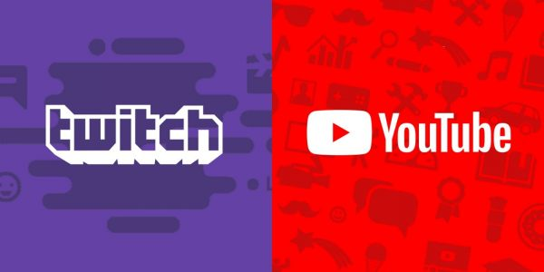

# Règlement du streamer

---

  

## Être intégré dans la communauté

Il est important avant de pouvoir streamer de **s’intégrer** au sein de la **communauté**. Par **intégration**, nous souhaitons que vous soyez connu de tous dans la communauté pour que nous puissions vous accorder notre confiance au maximum.
Venir juste pour streamer est très mal vu à la SADoJ et surtout par les streamers confirmés.

Si vous pensez que streamer est plus important que la SADoJ, nous vous invitons à réfléchir avant de vous **engager** dans une **communauté**, ou d’en choisir une qui accepte ce genre d’attitude.

Participer à la SADoJ est tout aussi important que **l’intégration**. Il est important de se demander *“Que puis-je apporter à la communauté ?”* Question qui vous a d'ailleurs été posée lors de votre recrutement. Voici plusieurs exemples de **participations** à la vie communautaire :

* Acte de présence
* Entraide
* Aide financière
* Aide au développement
* …

## La SADoJ et vos viewers jugent votre stream

Comme écrit ci-dessus, les membres et vos viewers **jugeront** votre stream. C’est quelque chose qui se fait naturellement. Et si nous ou vos viewers estiment que vous faites “de la merde”. Posez vous la bonne question “Suis-je apte à streamer ?”

Il est a savoir qu'il est **interdit** de diffuser du contenu pornographique.

### Le contenu est 100% RP ?

**Pour les contenus 100% RP, il n'est pas nécessaire de faire une demande (vidéo promotionnelle, vlog d’un personnage etc…).**

### Pas public ?

**Si ce n’est pas partagé en public, pas besoin d’autorisation également.**

## Qualité requise

Nous **conseillons** aux streamers de diffuser une qualité d’image de 720p pour proposer un contenu de qualité pour votre public et aussi pour **l’image** que vous projetez. Car vous êtes en quelque sorte la **vitrine** de la SADoJ.

La résolution de votre écran est tout aussi importante que la qualité d’image que vous projetez sur votre stream. Avoir une image écrasée ou Déformée n’est pas ce que nous pourrions juger comme stream de qualité. Avant chaque stream il est important de bien régler son logiciel pour ne pas avoir une diffusion saccadée. Avant chaque Stream faites des tests afin de ne pas avoir de désagréments lors du début de votre live. Si vous ne parvenez pas à régler votre stream de manière optimale, annulez-le. Ce n’est pas la fin du monde si vous ne streamez pas un soir…

Cela semble logique que quand vous streamez, les viewers puissent bien vous entendre et aussi pour montrer l’importance d'avoir un micro de **qualité** pour les personnes avec qui vous communiquez.

## Avoir un RP correct

En tant que Streamer vous êtes la vitrine de la SADoJ, avoir un RP correct est donc primordial tant pour votre stream que pour les autres joueurs sur le serveur.

Avoir un streamer qui pratique le power gaming ou, pire encore, le metagaming est mal vu par la communauté et sera passible d'une sanction, peu importe que vous ayez 1 500 ou 2 000 000 d'abonnés.

## Droit de stream

### Vote

Si vous souhaitez streamer, vous devez demander en réunion l’avis à la communauté via un vote (vote sur une semaine : OUI ; NON ; A REVOIR), avec comme support un stream ou une vidéo de test du serveur life US en non répertoriée.

### Révocation du droit

Tout membre peut demander de revoir le mandat d'un streamer lors d'une réunion (**vote immédiat**). Problèmes récurrents de RP, qualité basse, manque d’investissement etc… sont des motifs pouvant motiver un vote. Le départ de la communauté ou un vote sanction (serveur ou communautaire) **annule le droit de stream**.

### Pour appuyer la demande

* Vous devez être présent depuis un mois dans la communauté.
  * Sauf si:
    * Vous avez au minimum une moyenne de 25 spectateurs sur les 30 derniers jours.
    * Et vous avez diffusé en direct au minimum 10 heures sur les 30 derniers jours.
* Présence obligatoire en réunion
* Réaliser un “live test” qui sera ensuite joint à la demande
* Avertir la communauté que vous allez faire un “live test” en direct sur YouTube ou Twitch. La rediffusion sera également joint à la demande.
* La démo doit être récente (moins d’un mois).

## Publicité

Afin de promouvoir son contenu dans le salon Discord [#stream-sadojien](https://discord.com/channels/428563562701783051/836845975694868510):

* Le créateur de contenu doit avoir son droit de stream.
* Le contenu ne doit promouvoir un autre serveur GTA RP.

