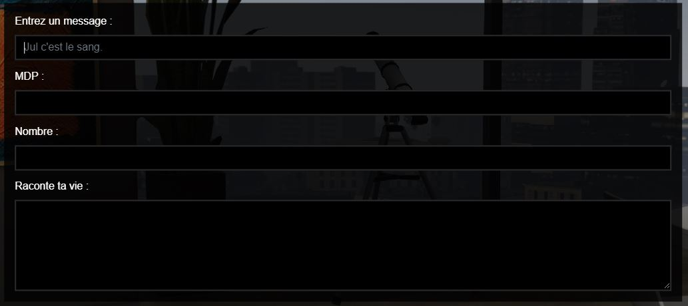

# sadoj-keyboard

> Auteur de la page: Pierre.

---

## Informations

* Auteurs du script: Pierre
* Emplacement: `[SCRIPT]/[BASE]/sadoj-keyboard`

Ce script permet d'entrer du texte depuis son clavier (copier/coller, choix du format des données, etc...).

Il existe différents types de champs et différents paramètres. Si vous avez des suggestions merci de contacter l'auteur du script.



<kbd>Entrée</kbd> permet de valider le formulaire.

<kbd>Échap</kbd> permet d'annuler la saisie.

## Utilisation

<!-- tabs:start -->

#### **Export**

```lua
local keyboard --[[ boolean ]], result --[[ string ]] [, [...] --[[ string ]]]  = exports["sadoj-keyboard"]:Keyboard(data --[[ table ]])
```

* **Paramètres:**
  * **data:** Configuration des entrées.

    ```lua
    local data = {
        header = "Titre", -- Permet d'afficher un titre principal en haut de la boite de dialogue, facultatif
        rows = {} -- Tableau avec les différents champs (1 minimum), voir configuration des champs
    }
    ```

* **Résultats:**
  * **keyboard:** `true` si le formulaire a été validé avec succès (`false` sinon)
  * **result:** Résultat du premier champ
  * **[...]:** Résultat des champs suivants

<!-- tabs:end -->

### Configuration des champs

#### text

`text` est le type par défaut d'un champ. Il permet de pouvoir entrer du texte sans passage de ligne.

```lua
{
  label = "Label"  --[[ string ]], -- Facultatif. Nom du champ. Chaîne vide par défaut.
  type = "text" --[[ string ]], -- Facultatif (type par défaut).
  required = true --[[ boolean ]], -- Facultatif. Un attribut qui indique que le champ doit être renseigné avant de pouvoir envoyer le formulaire. Vrai par défaut.
  maxlength = 255 --[[ number ]], -- Facultatif. Le nombre de caractères maximal qui peut être écrit dans ce champ. 255 par défaut.
  minlength = 0 --[[ number ]], -- Facultatif. Le nombre de caractères maximal qui peut être écrit dans ce champ. 0 par défaut.
  placeholder = "Entre du texte" --[[ string ]], -- Facultatif. Une valeur d'exemple qui sera affichée lorsqu'aucune valeur n'est saisie. Rien par défaut.
  pattern = "[a-z]+" --[[ string ]] -- Facultatif. Une expression rationnelle à laquelle doit correspondre le texte saisi pour être valide. Rien par défaut.
}
```

#### password

`password` est un champ permettant de rentrer un mot de passe (les caractères sont remplacés par des points).

```lua
{
  label = "Label"  --[[ string ]], -- Facultatif. Nom du champ. Chaîne vide par défaut.
  type = "password" --[[ string ]],
  required = true --[[ boolean ]], -- Facultatif. Un attribut qui indique que le champ doit être renseigné avant de pouvoir envoyer le formulaire. Vrai par défaut.
  maxlength = 255 --[[ number ]], -- Facultatif. Le nombre de caractères maximal qui peut être écrit dans ce champ. 255 par défaut.
  minlength = 0 --[[ number ]], -- Facultatif. Le nombre de caractères maximal qui peut être écrit dans ce champ. 0 par défaut.
  placeholder = "Entre un mot de passe" --[[ string ]], -- Facultatif. Une valeur d'exemple qui sera affichée lorsqu'aucune valeur n'est saisie. Rien par défaut.
  pattern = "[a-z]+" --[[ string ]] -- Facultatif. Une expression rationnelle à laquelle doit correspondre le texte saisi pour être valide. Rien par défaut.
}
```

#### number

`number` est un champ permettant de rentrer un nombre.

```lua
{
  label = "Label"  --[[ string ]], -- Facultatif. Nom du champ. Chaîne vide par défaut.
  type = "number" --[[ string ]],
  required = true --[[ boolean ]], -- Facultatif. Un attribut qui indique que le champ doit être renseigné avant de pouvoir envoyer le formulaire. Vrai par défaut.
  max = 255 --[[ number ]], -- Facultatif. La valeur maximale qui peut être acceptée. Rien par défaut.
  min = 0 --[[ number ]], -- Facultatif. La valeur minimale qui peut être acceptée. Rien par défaut.
  placeholder = "Entre un nombre" --[[ string ]], -- Facultatif. Une valeur d'exemple qui sera affichée lorsqu'aucune valeur n'est saisie. Rien par défaut.
  step = 1 --[[ number ]] -- Facultatif. Le pas à utiliser pour incrémenter la valeur à l'aide du contrôle fourni par l'agent utilisateur. Cet incrément est également utilisé pour la validation de la valeur. 1 par défaut.
}
```

#### textarea

`number` est un champ permettant de rentrer du texte avec des retours à la ligne.

Pour passer une ligne, l'utilisateur doit faire <kbd>Shift</kbd> + <kbd>Entrée</kbd> (comme sur Discord).

```lua
{
  label = "Label"  --[[ string ]], -- Facultatif. Nom du champ. Chaîne vide par défaut.
  type = "textarea" --[[ string ]],
  required = true --[[ boolean ]], -- Facultatif. Un attribut qui indique que le champ doit être renseigné avant de pouvoir envoyer le formulaire. Vrai par défaut.
  maxlength = 255 --[[ number ]], -- Facultatif. Le nombre de caractères maximal qui peut être écrit dans ce champ. 255 par défaut.
  minlength = 0 --[[ number ]], -- Facultatif. Le nombre de caractères maximal qui peut être écrit dans ce champ. 0 par défaut.
  placeholder = "Entre beaucoup de texte" --[[ string ]] -- Facultatif. Une valeur d'exemple qui sera affichée lorsqu'aucune valeur n'est saisie. Rien par défaut.
}
```