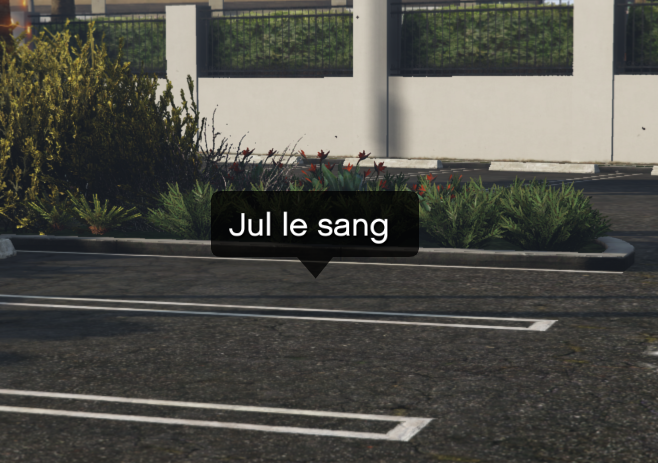

# sadoj-ui - Textes d'aide

> Auteur de la page: Pierre.

---

Texte d'aide qui s'affiche en haut à gauche de l'écran.

## DisplayHelpText

<!-- tabs:start -->

### **Export (client)**

```lua
exports["sadoj-ui"]:DisplayHelpText(text --[[ string ]][, beep --[[ boolean ]]])
```

* **Paramètres:**
  * **text:** Texte d'aide (moins de 100 caractères).
  * **beep:** Si vrai, un beep sonore est joué. `false` par défaut.

### **Event (client)**

```lua
TriggerEvent("sadoj-ui:client:DisplayHelpText", text --[[ string ]][, beep --[[ boolean ]]])
```

* **Paramètres:**
  * **text:** Texte d'aide (moins de 100 caractères).
  * **beep:** Si vrai, un beep sonore est joué. `false` par défaut.

### **Event (serveur)**

```lua
TriggerClientEvent("sadoj-ui:client:DisplayHelpText", serverId --[[ integer ]], text --[[ string ]][, beep --[[ boolean ]]])
```

* **Paramètres:**
  * **text:** Texte d'aide (moins de 100 caractères).
  * **beep:** Si vrai, un beep sonore est joué. `false` par défaut.

<!-- tabs:end -->

## DisplayHelpTextWithTextEntry

<!-- tabs:start -->

### **Export (client)**

```lua
exports["sadoj-ui"]:DisplayHelpTextWithTextEntry(entryKey --[[ string ]], params --[[ table ]][, beep --[[ boolean ]]])
```

* **Paramètres:**
  * **entryKey:** entryKey du dialogue.
  * **params:** Tableau de chaînes de caractères. Tableau vide si aucun paramètre dans l'entryKey.
  * **beep:** Si vrai, un beep sonore est joué. `false` par défaut.

### **Event (client)**

```lua
TriggerEvent("sadoj-ui:client:DisplayHelpTextWithTextEntry", entryKey --[[ string ]], params --[[ table ]][, beep --[[ boolean ]]])
```

* **Paramètres:**
  * **entryKey:** entryKey du dialogue.
  * **params:** Tableau de chaînes de caractères. Tableau vide si aucun paramètre dans l'entryKey.
  * **beep:** Si vrai, un beep sonore est joué. `false` par défaut.

### **Event (serveur)**

```lua
TriggerClientEvent("sadoj-ui:client:DisplayHelpTextWithTextEntry", serverId --[[ integer ]], entryKey --[[ string ]], params --[[ table ]][, beep --[[ boolean ]]])
```

* **Paramètres:**
  * **entryKey:** entryKey du dialogue.
  * **params:** Tableau de chaînes de caractères. Tableau vide si aucun paramètre dans l'entryKey.
  * **beep:** Si vrai, un beep sonore est joué. `false` par défaut.

<!-- tabs:end -->

## DisplayFloatingHelpText

Cette fonction doit être appelée à chaque frame pour fonctionner correctement.



<!-- tabs:start -->

### **Export (client)**

```lua
exports["sadoj-ui"]:DisplayFloatingHelpText(text --[[ string ]], coords --[[ vector3 ]][, beep --[[ boolean ]]])
```

* **Paramètres:**
  * **text:** Texte d'aide (moins de 100 caractères).
  * **coords:** Coordonnées où afficher le texte.
  * **beep:** Si vrai, un beep sonore est joué. `false` par défaut.

<!-- tabs:end -->

## DisplayFloatingHelpTextWithTextEntry

<!-- tabs:start -->

### **Export (client)**

```lua
exports["sadoj-ui"]:DisplayFloatingHelpTextWithTextEntry(entryKey --[[ string ]], params --[[ table ]], coords --[[ vector3 ]][, beep --[[ boolean ]]])
```

* **Paramètres:**
  * **entryKey:** entryKey du dialogue.
  * **params:** Tableau de chaînes de caractères. Tableau vide si aucun paramètre dans l'entryKey.
  * **coords:** Coordonnées où afficher le texte.
  * **beep:** Si vrai, un beep sonore est joué. `false` par défaut.

<!-- tabs:end -->

{docsify-updated}
