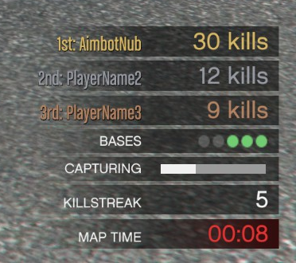

# sadoj-ui - Timerbars

> Auteur de la page: Pierre.

---

Barres qui s'affichent en bas à droite de l'écran.

Exemple non-exhaustif de ce qui est possible:



## AddTextTimerBar

Ajoute une timer bar avec un titre et un texte.

<!-- tabs:start -->

### **Export (client)**

```lua
local barId --[[ string ]] = exports["sadoj-ui"]:AddTextTimerBar(title --[[ string ]], text --[[ string ]])
```

* **Paramètres:**
  * **title:** Titre de la barre.
  * **text:** Texte de la barre.
* **Retour:**
  * **barId:** Identifiant de la barre.

<!-- tabs:end -->

## AddPlayerTimerBar

Ajoute une timer bar avec un titre d'une police d'écriture différente et un texte.

<!-- tabs:start -->

### **Export (client)**

```lua
local barId --[[ string ]] = exports["sadoj-ui"]:AddPlayerTimerBar(title --[[ string ]], text --[[ string ]])
```

* **Paramètres:**
  * **title:** Titre de la barre.
  * **text:** Texte de la barre.
* **Retour:**
  * **barId:** Identifiant de la barre.

<!-- tabs:end -->

## AddBarTimerBar

Ajoute une timer bar avec une barre de progression.

<!-- tabs:start -->

### **Export (client)**

```lua
local barId --[[ string ]] = exports["sadoj-ui"]:AddBarTimerBar(title --[[ string ]][, progress --[[ number ]]])
```

* **Paramètres:**
  * **title:** Titre de la barre.
  * **progress:** Progression de la barre de 0.0 à 1.0. 0.0 par défaut.
* **Retour:**
  * **barId:** Identifiant de la barre.

<!-- tabs:end -->

## AddCheckpointTimerBar

Ajoute une timer bar avec un titre et des checkpoints.

<!-- tabs:start -->

### **Export (client)**

```lua
local barId --[[ string ]] = exports["sadoj-ui"]:AddCheckpointTimerBar(title --[[ string ]], numCheckpoints --[[ integer ]])
```

* **Paramètres:**
  * **title:** Titre de la barre.
  * **numCheckpoints:** Nombre de checkpoints entre 1 et 16.
* **Retour:**
  * **barId:** Identifiant de la barre.

<!-- tabs:end -->

## DoesTimerBarExist

Permet de savoir si une timer bar existe.

<!-- tabs:start -->

### **Export (client)**

```lua
local doesExist --[[ boolean ]] = exports["sadoj-ui"]:DoesTimerBarExist(barId --[[ string ]])
```

* **Paramètres:**
  * **barId:** Identifiant de la barre.
* **Retour:**
  * **doesExist:** `true` si la barre existe, `false` sinon.

<!-- tabs:end -->

## RemoveTimerBar

Permet de supprimer une timer bar.

<!-- tabs:start -->

### **Export (client)**

```lua
exports["sadoj-ui"]:RemoveTimerBar(barId --[[ string ]])
```

* **Paramètres:**
  * **barId:** Identifiant de la barre.

<!-- tabs:end -->

## HideTimerBar

Permet de cacher une timer bar.

<!-- tabs:start -->

### **Export (client)**

```lua
exports["sadoj-ui"]:HideTimerBar(barId --[[ string ]])
```

* **Paramètres:**
  * **barId:** Identifiant de la barre.

<!-- tabs:end -->

## ShowTimerBar

Permet d'afficher une timer bar.

<!-- tabs:start -->

### **Export (client)**

```lua
exports["sadoj-ui"]:ShowTimerBar(barId --[[ string ]])
```

* **Paramètres:**
  * **barId:** Identifiant de la barre.

<!-- tabs:end -->

## SetTimerBarTitle

Permet de modifier le titre d'une timer bar.

<!-- tabs:start -->

### **Export (client)**

```lua
exports["sadoj-ui"]:SetTimerBarTitle(barId --[[ string ]], title --[[ string ]])
```

* **Paramètres:**
  * **barId:** Identifiant de la barre.
  * **title:** Titre de la barre.

<!-- tabs:end -->

## SetTimerBarTitleColor

Permet de modifier la couleur du titre d'une timer bar.

<!-- tabs:start -->

### **Export (client)**

```lua
exports["sadoj-ui"]:SetTimerBarTitleColor(barId --[[ string ]], color --[[ any ]])
```

* **Paramètres:**
  * **barId:** Identifiant de la barre.
  * **color:** Couleur du titre.
    * **integer:** Index d'une couleur HUD. [Voir les couleurs ici.](https://docs.fivem.net/docs/game-references/hud-colors/)
    * **table:** Tableau `{R, G, B, A}` de 0 à 255.

<!-- tabs:end -->

## SetTimerBarHighlightColor

Permet de modifier la couleur d'accentuation d'une timer bar.

<!-- tabs:start -->

### **Export (client)**

```lua
exports["sadoj-ui"]:SetTimerBarHighlightColor(barId --[[ string ]], color --[[ any ]])
```

* **Paramètres:**
  * **barId:** Identifiant de la barre.
  * **color:** Couleur d'accentuation.
    * **integer:** Index d'une couleur HUD. [Voir les couleurs ici.](https://docs.fivem.net/docs/game-references/hud-colors/)
    * **table:** Tableau `{R, G, B, A}` de 0 à 255.

<!-- tabs:end -->

## SetTimerBarText

Permet de modifier le texte d'une timer bar.

> [!ATTENTION]
> Cette fonction est uniquement disponible pour les `TextTimerBar` et `PlayerTimerBar`.

<!-- tabs:start -->

### **Export (client)**

```lua
exports["sadoj-ui"]:SetTimerBarText(barId --[[ string ]], text --[[ string ]])
```

* **Paramètres:**
  * **barId:** Identifiant de la barre.
  * **text:** Texte de la barre.

<!-- tabs:end -->

## SetTimerBarColor

Permet de modifier la couleur du titre et du texte d'une timer bar.

Pour une `CheckpointTimerBar`, cela change la couleur des checkpoints réussis.

> [!ATTENTION]
> Cette fonction est uniquement disponible pour les `TextTimerBar`, `PlayerTimerBar` et `CheckpointTimerBar`.

<!-- tabs:start -->

### **Export (client)**

```lua
exports["sadoj-ui"]:SetTimerBarColor(barId --[[ string ]], color --[[ any ]])
```

* **Paramètres:**
  * **barId:** Identifiant de la barre.
  * **color:** Couleur de la barre.
    * **integer:** Index d'une couleur HUD. [Voir les couleurs ici.](https://docs.fivem.net/docs/game-references/hud-colors/)
    * **table:** Tableau `{R, G, B, A}` de 0 à 255.

<!-- tabs:end -->

## SetTimerBarProgress

Permet de modifier la progression d'une timer bar.

> [!ATTENTION]
> Cette fonction est uniquement disponible pour les `BarTimerBar`.

<!-- tabs:start -->

### **Export (client)**

```lua
exports["sadoj-ui"]:SetTimerBarProgress(barId --[[ string ]], progress --[[ number ]])
```

* **Paramètres:**
  * **barId:** Identifiant de la barre.
  * **progress:** Progression de la barre de 0.0 à 1.0.

<!-- tabs:end -->

## SetTimerBarBackgroundColor

Permet de modifier la couleur de fond de la bar de progression d'une timer bar.

> [!ATTENTION]
> Cette fonction est uniquement disponible pour les `BarTimerBar`.

<!-- tabs:start -->

### **Export (client)**

```lua
exports["sadoj-ui"]:SetTimerBarBackgroundColor(barId --[[ string ]], color --[[ any ]])
```

* **Paramètres:**
  * **barId:** Identifiant de la barre.
  * **color:** Couleur de fond de la barre.
    * **integer:** Index d'une couleur HUD. [Voir les couleurs ici.](https://docs.fivem.net/docs/game-references/hud-colors/)
    * **table:** Tableau `{R, G, B, A}` de 0 à 255.

<!-- tabs:end -->

## SetTimerBarForegroundColor

Permet de modifier la couleur de la bar de progression d'une timer bar.

> [!ATTENTION]
> Cette fonction est uniquement disponible pour les `BarTimerBar`.

<!-- tabs:start -->

### **Export (client)**

```lua
exports["sadoj-ui"]:SetTimerBarForegroundColor(barId --[[ string ]], color --[[ any ]])
```

* **Paramètres:**
  * **barId:** Identifiant de la barre.
  * **color:** Couleur de la barre.
    * **integer:** Index d'une couleur HUD. [Voir les couleurs ici.](https://docs.fivem.net/docs/game-references/hud-colors/)
    * **table:** Tableau `{R, G, B, A}` de 0 à 255.

<!-- tabs:end -->

## SetTimerBarInProgressColor

Permet de modifier la couleur des checkpoints en cours de progression d'une timer bar.

> [!ATTENTION]
> Cette fonction est uniquement disponible pour les `CheckpointTimerBar`.

<!-- tabs:start -->

### **Export (client)**

```lua
exports["sadoj-ui"]:SetTimerBarInProgressColor(barId --[[ string ]], color --[[ any ]])
```

* **Paramètres:**
  * **barId:** Identifiant de la barre.
  * **color:** Couleur des checkpoints en cours de progression.
    * **integer:** Index d'une couleur HUD. [Voir les couleurs ici.](https://docs.fivem.net/docs/game-references/hud-colors/)
    * **table:** Tableau `{R, G, B, A}` de 0 à 255.

<!-- tabs:end -->

## SetTimerBarFailedColor

Permet de modifier la couleur des checkpoints échoués d'une timer bar.

> [!ATTENTION]
> Cette fonction est uniquement disponible pour les `CheckpointTimerBar`.

<!-- tabs:start -->

### **Export (client)**

```lua
exports["sadoj-ui"]:SetTimerBarFailedColor(barId --[[ string ]], color --[[ any ]])
```

* **Paramètres:**
  * **barId:** Identifiant de la barre.
  * **color:** Couleur des checkpoints échoués.
    * **integer:** Index d'une couleur HUD. [Voir les couleurs ici.](https://docs.fivem.net/docs/game-references/hud-colors/)
    * **table:** Tableau `{R, G, B, A}` de 0 à 255.

<!-- tabs:end -->

## SetTimerBarCheckpointState

Permet de modifier l'état d'un checkpoint d'une timer bar.

> [!ATTENTION]
> Cette fonction est uniquement disponible pour les `CheckpointTimerBar`.

<!-- tabs:start -->

### **Export (client)**

```lua
exports["sadoj-ui"]:SetTimerBarCheckpointState(barId --[[ string ]], checkpointIndex --[[ number ]], state --[[ integer ]])
```

* **Paramètres:**
  * **barId:** Identifiant de la barre.
  * **checkpointIndex:** Index du checkpoint (commençant à 0).
  * **state:** Etat du checkpoint.
    * **0:** Le checkpoint est en cours de progression.
    * **1:** Le checkpoint est réussi.
    * **2:** Le checkpoint est échoué.

<!-- tabs:end -->

## SetTimerBarAllCheckpointsState

Permet de modifier l'état de tous les checkpoints d'une timer bar.

> [!ATTENTION]
> Cette fonction est uniquement disponible pour les `CheckpointTimerBar`.

<!-- tabs:start -->

### **Export (client)**

```lua
exports["sadoj-ui"]:SetTimerBarAllCheckpointsState(barId --[[ string ]], state --[[ integer ]])
```

* **Paramètres:**
  * **barId:** Identifiant de la barre.
  * **state:** Etat de tous les checkpoints.
    * **0:** Tous les checkpoints sont en cours de progression.
    * **1:** Tous les checkpoints sont réussis.
    * **2:** Tous les checkpoints sont échoués.

<!-- tabs:end -->

{docsify-updated}
