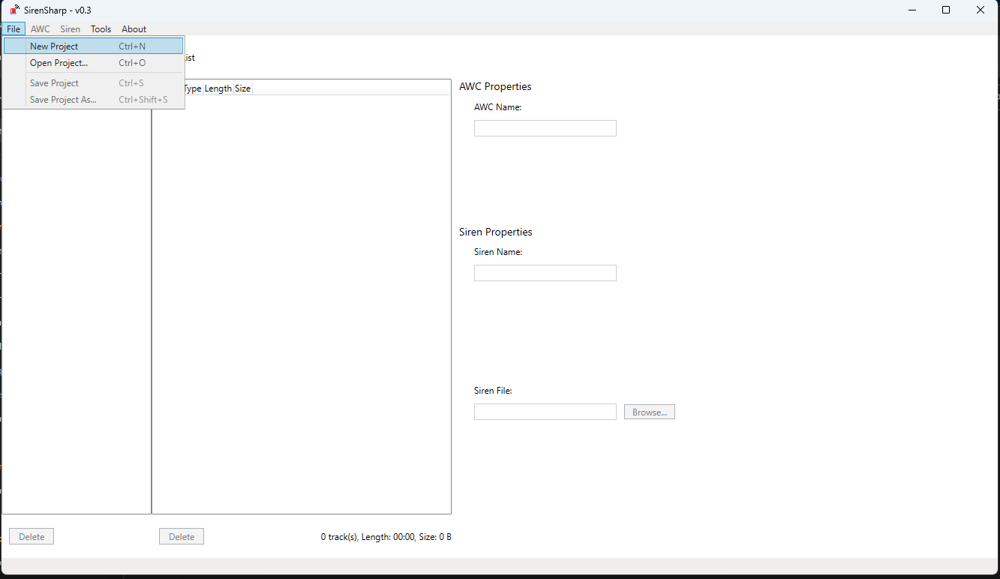
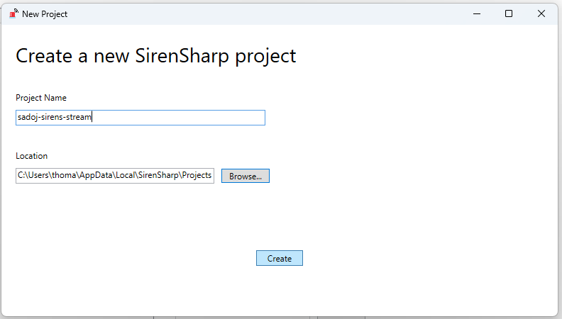
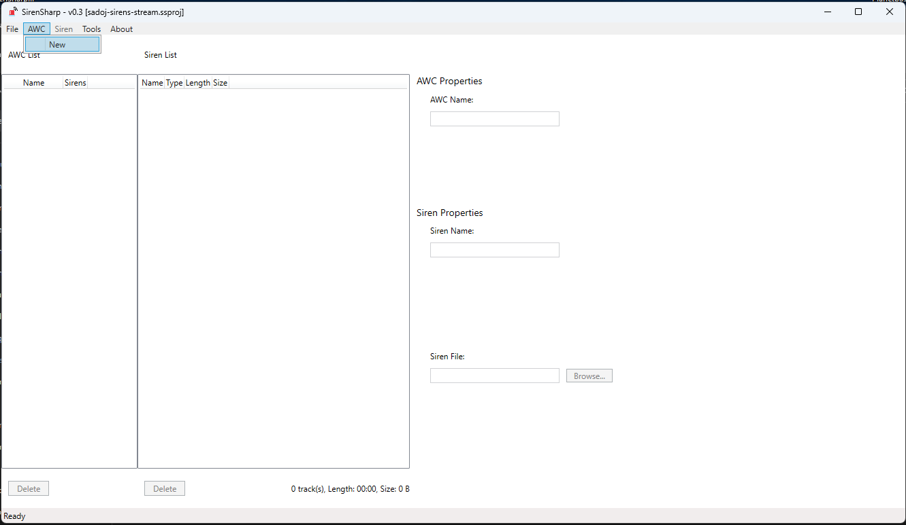
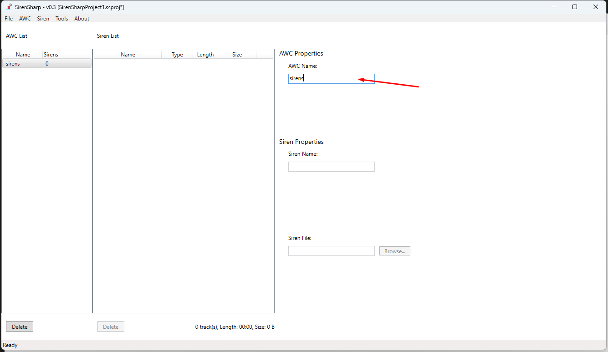
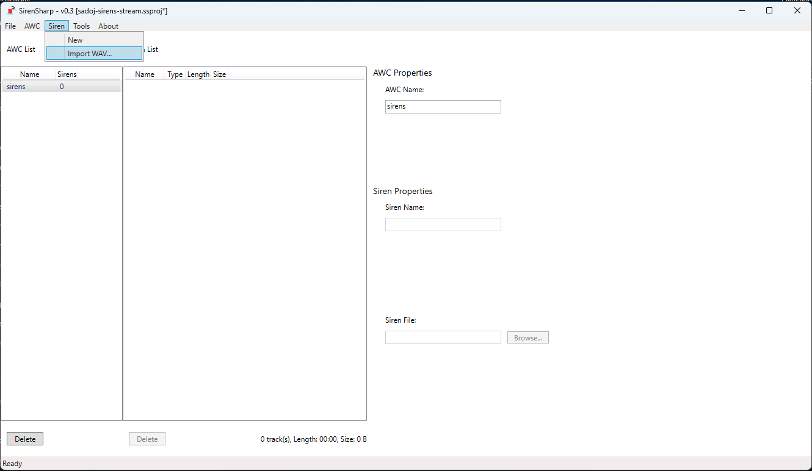
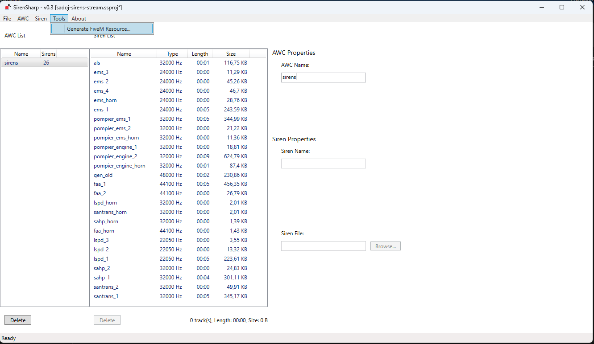
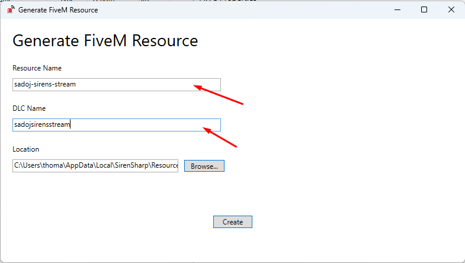

# Modification des sirènes

> Auteur de la page: Thomas.

---

### Informations

* Auteurs du logiciel : BJDubb
* Version du logiciel : 0.3

## Étape 1 : Installation de SirenSharp

1. Téléchargez la dernière version de SirenSharp [ici](https://github.com/BJDubb/SirenSharp/releases)

2. Décompressez le fichier téléchargé dans le dossier de votre choix

## Étape 2 : Modification des sirènes

1. Demandez à un développeur de vous donner le dossier `sadoj-sirens-source`. (Chemin : `SERVEUR/Life_US_Dev_2/ServerData/resources/[UNIQUEDEV]/sadoj-sirens-source`)

2. Modifiez, ajoutez ou supprimez les fichiers `.wav` du dossier `sadoj-sirens-source` en fonction de vos besoins. (Uniquement des fichiers `.wav`)

3. Ouvrez SirenSharp.exe

4. Cliquez sur `File` puis `New Project`.

5. Dans `Project Name`, entrez `sadoj-sirens-stream` puis cliquez sur `Create`.

6. Cliquez sur `AWC` puis `New`.

7. Dans `AWC Name`, entrez `sirens`.

8. Cliquez sur `Siren` puis `Import Wav`.

9.  Sélectionnez tous les fichiers `.wav` du dossier `sadoj-sirens-source` puis cliquez sur `Ouvrir`.

10.  Cliquez sur `Tools` puis `Generate FiveM Resource`.

11. Dans `Resource Name`, entrez `sadoj-sirens-stream`, dans `DLC Name`, entrez `sadojsirensstream` puis cliquez sur `Create`.

12. Renvoyez le dossier `sadoj-sirens-stream` à un développeur. (Chemin : `SERVEUR/Life_US_Dev_2/ServerData/resources/[STREAM]/sadoj-sirens-stream`)

13. Renvoyez le dossier `sadoj-sirens-source` à un développeur. (Chemin : `SERVEUR/Life_US_Dev_2/ServerData/resources/[UNIQUEDEV]/sadoj-sirens-source`)

{docsify-updated}
