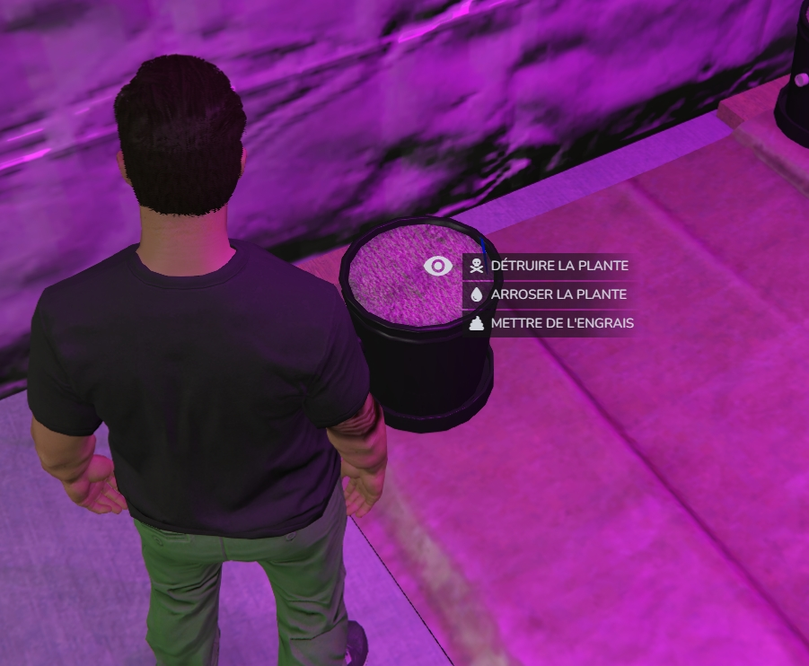
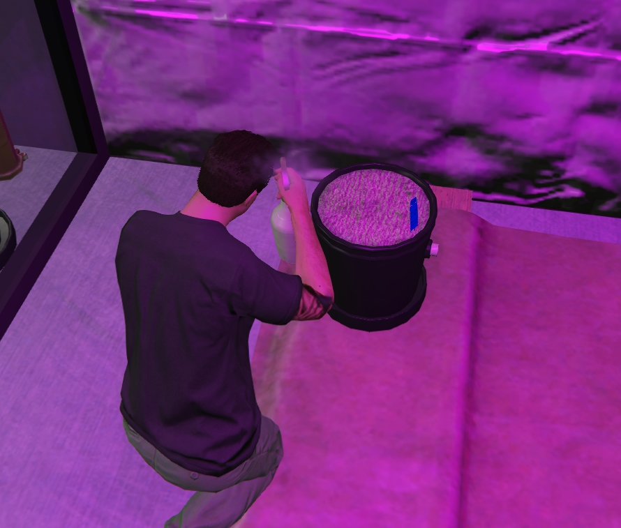
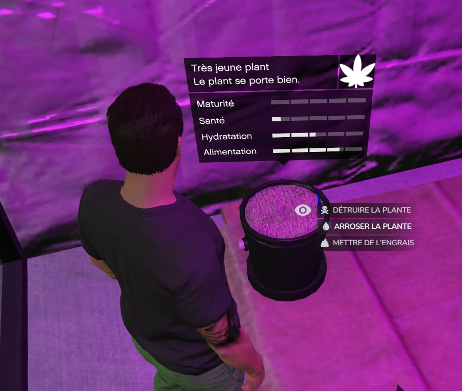
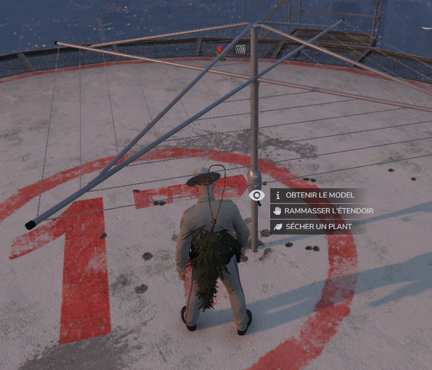
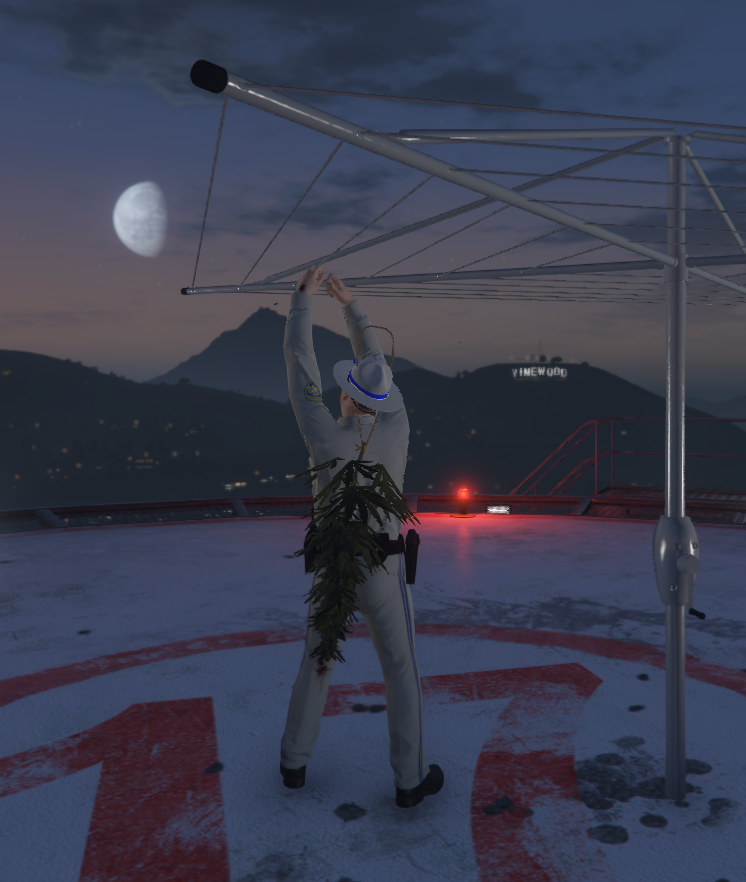
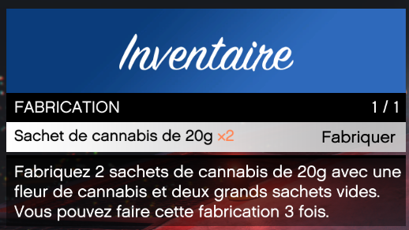
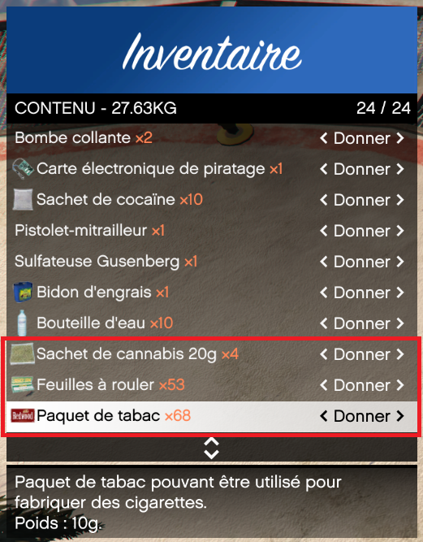
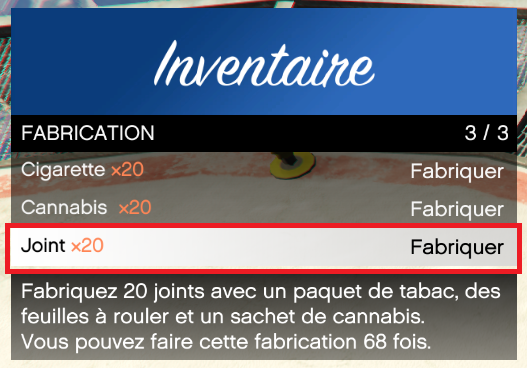

# Production de Cannabis
		
> Auteur de la page : Lorr’andMaps/WRC. 

## Introduction

Il vous est possible de faire pousser vous-même votre propre cannabis.  Pour cela, il faut vous fournir auprès du `Smoke on the Water` de nombreux produits. `Pot, Sac de terreau, Engrais, graines, etc…`

## Plantation

Vous devez déposer le pot au sol. 
Grâce à l'onglet `utiliser` dans votre inventaire `F2`, ainsi  qu'à l'aide de votre `clic gauche souris` vous pourrez le déposer devant vous. 

Une fois cela fait, vous pourrez le remplir de terreau via la touche `alt` de votre clavier. Toujours grâce au `alt`, vous pourrez planter une `graine de cannabis`. 

A partir de là, votre plant de Cannabis va se développer seul, 
Cependant, il est indispensable de l’arroser pour qu'il puisse se développer correctement. De plus, il est possible de lui ajouter de l’engrais de façon à améliorer ses qualités. 

> [!NOTE] À vous de trouver la bonne quantité d'eau et d'engrais afin qu’il ne dépérisse pas. 

## Séchage de plants

Une fois votre plant arrivé à maturité, il vous sera proposé de le récolter via `alt`. 
Il faudra installer un `étendoir`, son positionnement influencera sur sa qualité ainsi que son temps de séchage. 
Pour ce faire, il vous devrait `l’utiliser` dans votre `inventaire` via `F2`

Une fois celui-ci installé à l’endroit choisi, vous pourrez accrocher dessus vos plants à faire sécher via `alt`. 

> [!NOTE] Regardez bien le pied de l’étendoir avec votre `alt`. 

Sec, vous pourrez les récupérer en les regardant avec `alt`. 
En les décrochant, vous récupérerez plusieurs `fleurs de cannabis`. 

## Mise en sachet
		
En achetant des `sachets moyens vides`, vous pourrez utiliser les `fleurs de cannabis` pour fabriquer des `sachets de cannabis de 10g`

En achetant des `grands sachets vides`, vous pourrez utiliser les `fleurs de cannabis` pour fabriquer des `sachets de cannabis de 20g`
Vous pourrez ainsi les vendre dans les rues. 

## Consommations

En vous fournissant de `sachets de cannabis de 20g`, de `paquets de tabacs` et de `feuilles à rouler` auprès de `Smoke on the Water`, ou dans une `Supérette`, vous pourrez fabriquer, via l’onglet `Fabrication` dans votre Inventaire `F2` des joints,  à vendre ou pour votre consommation personnelle.

Pour consommer dans un `Bang`, le cannabis récupéré dans un `sachet de cannabis de 10g, il faudra vous munir  d’une `cigarette`, et d’un `briquet` à retrouver en vente au `Smoke on the Water` ou dans une `Supérette` ainsi qu’un `bang` achetable au `Smoke on the Water`. 

Une fois tout cela récupéré, il vous suffira de faire `utiliser` sur votre Bang dans votre inventaire `F2`. 

