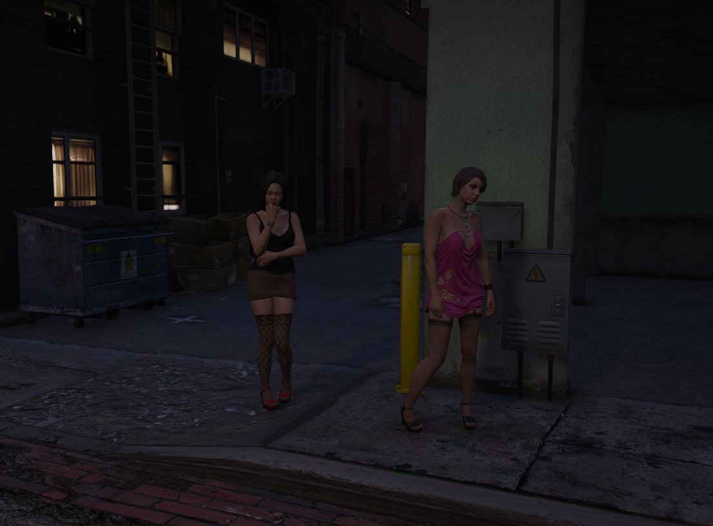
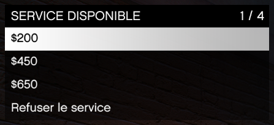

# Les prostituées

> Auteur de la page: Thomas.

---

## Introduction

Les prostituées sont des personnages non-joueurs qui peuvent être rencontrés sur les trottoirs. Il est possible de les trouver en se baladant dans les rues. Elles sont reconnaissables par leur tenue vestimentaire et leur attitude.

Le plus souvent, elles sont présentes pendant la nuit.

## Comment ça marche ?

Il est possible d'interagir avec les prostituées en appuyant sur la touche `E` lorsque vous êtes à proximité d'elles et dans un véhicule. Il est possible de les inviter à monter dans votre véhicule.

Une fois dans le véhicule, il faudra se rendre dans un endroit isolé pour pouvoir interagir avec elle. Il est possible de se rendre dans un parking, un garage, une ruelle, etc...

Quand vous êtes dans un endroit isolé, la prostituée va vous proposer 3 services:

## Les risques

Quand vous faites monter une prostituée dans votre véhicule, vous prenez le risque que quelqu'un appelle la police. Si la police est appelée, une description de votre véhicule sera donnée aux forces de l'ordre.

## Conclusion

Le système de prostitution sur le serveur est un système quasi-identique à celui de GTA V. Ci dessous, vous trouverez une vidéo qui montre brièvement le système de prostitution.

<iframe src="https://www.youtube-nocookie.com/embed/pYpnjRoCf_c?si=LwzILVPSfaJcmV06" title="YouTube video player" frameborder="0" allow="accelerometer; autoplay; clipboard-write; encrypted-media; gyroscope; picture-in-picture; web-share" allowfullscreen></iframe>
