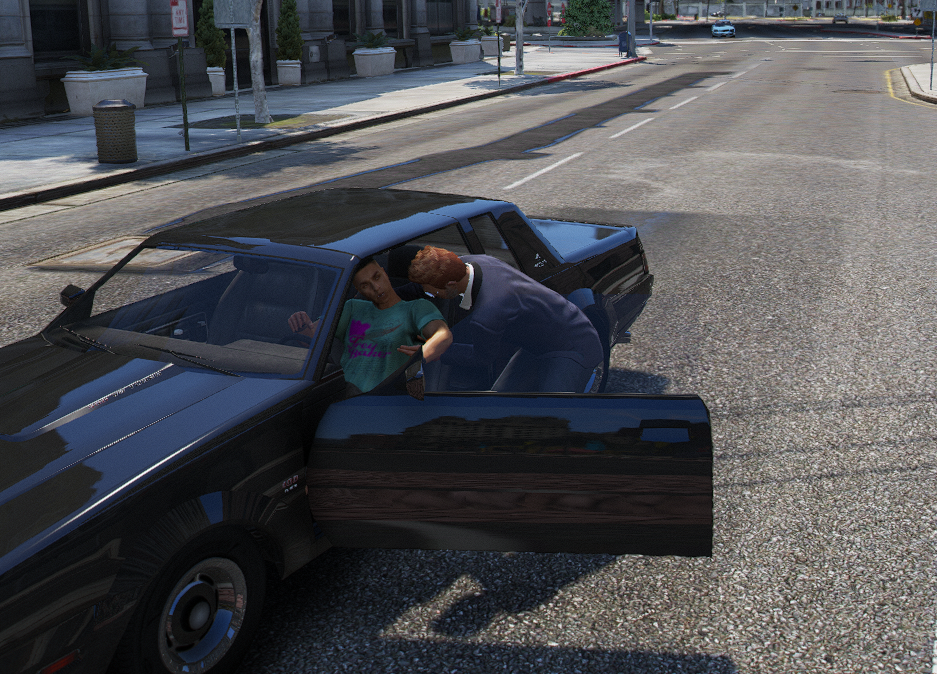

# Carjacking

> Auteur de la page: Thomas.

---

## Introduction

Le carjacking est une action qui consiste à éjecter le conducteur d'un véhicule en marche pour le voler. Cette action est réalisable par tout le monde.

## Comment réaliser un carjacking ?

Pour réaliser un carjacking, il faut tout d'abord être à proximité d'un véhicule en marche avec un conducteur. Ensuite, tenté tout simplement de monter dans le véhicule.

> [!ATTENTION]
> Si il n'y a pas de policier en service, il vous sera impossible de realiser un carjacking.

Les personnes conectées en tant que policier sur le dispatch peuvent effectuer un carjacking sur n'importe quel véhicule sans déclencher un appel. (Il faut rester logique et ne pas abuser de cette fonctionnalité).

> [!NOTE]
> Certains véhicules ne peuvent pas être volés comme conduits par un policier (PNJ).

## Risques

Un carjacking provoque automatiquement un appel à la police. Le véhicule sera automatiquement signalé comme volé sur le MDT.

Dans certains cas, le conducteur peut essayer de se défendre en sortant une arme à feu ou en essayant de vous éjecter du véhicule.