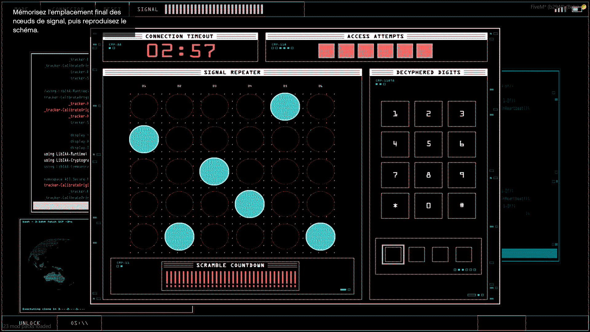
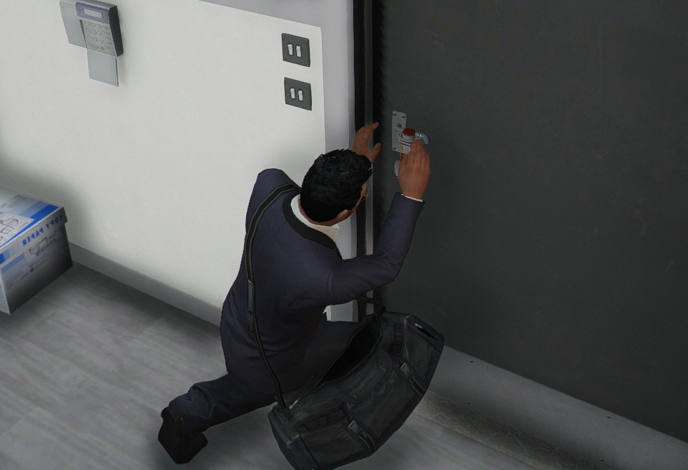

# Les portes

> Auteur de la page: Thomas.

---

## Introduction

Les portes sont un élément important permettent de protéger un lieu, de le rendre privé, de le rendre plus sécurisé, etc. Cependant, il est important de savoir comment les utiliser, et surtout comment les ouvrir.

Il existe deux façons de forcer une porte, la première et le piratage, la seconde et le l'explosif.

## Le piratage

Le piratage est une méthode qui permet d'ouvrir une porte sans la casser, et donc de pouvoir la fermer sans la réparer. Cependant, il faut savoir que le piratage est une méthode qui prend du temps. Il faut donc être sûr de ne pas être dérangé pendant le piratage. Cette méthode est disponible sur tout type de porte, qu'elle soit en bois, en métal, blindée, etc.

Les éléments nécessaires pour pirater une porte sont les suivants :
- 1× smartphone
- 1× carte de piratage

Pour démarrer le piratage, il faut se rendre devant la porte à pirater, et ouvrir le menu `ciblage` (touche `ALT` par défaut) en visant la porte. Il faut ensuite sélectionner l'options `Pirater`. Une fois le piratage lancé, un mini-jeu va apparaître.

Une fois le piratage terminé, la porte sera ouverte.

## L'explosif

L'explosif est une méthode qui permet d'ouvrir une porte en la cassant. Cela permet d'ouvrir une porte rapidement, mais cela a pour conséquence de casser la porte, et donc de ne plus pouvoir la fermer. Cette méthode n'est pas disponible sur toutes les portes.

Les éléments nécessaires pour forcer une porte avec de l'explosif sont les suivants :
- 1× charge thermique

Pour forcer une porte avec de l'explosif, il faut se rendre devant la porte à forcer, et ouvrir le menu `ciblage` (touche `ALT` par défaut) en visant la porte. Il faut ensuite sélectionner l'options `Charge thermique`. Une fois l'explosif posé, il faut s'éloigner de la porte, et attendre que l'explosif explose.

Une fois l'explosion terminée, la porte sera ouverte et cassée.

{docsify-updated}