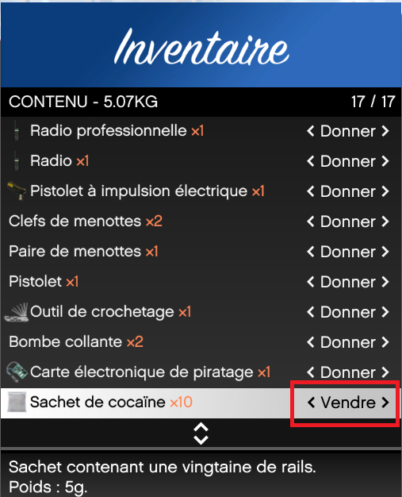
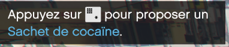

# Vente de drogue

> Auteur de la page: Lorr'and Maps.

---
## Introduction

La vente de drogue est une action qui permet de se faire de l’argent facilement. Cette action est illégale. 

> [!ATTENTION] Avant toute chose, assurez-vous d'avoir bien le bon nombre de policiers en service `Via radial menu`. 

## Prérequis

Pour pouvoir vendre, il faut vous fournir des sachets de drogue. Il existe différentes drogues (Cocaïne, Méthamphétamine, Ecstasy, Weed). Les différents marchés sont dirigés par différentes organisations, il faudra prendre contact avec elles via le Black Market afin d’acheter vos sachets. Cette action est illégale

## Procédure

Pour pouvoir commencer à vendre, il faut sélectionner l’option vendre du sachet de drogue.

Il vous suffira de vous approcher des passants afin de leur proposer un sachet. La touche préfigurée sera `E`.

> [!ATTENTION] Une fois l'interaction lancée, il vous sera impossible de la quitter avant d'avoir reçu votre argent. 

## Risques

Il est possible que certains passants refusent, et face un appel à la police. 
De plus, la police peut interroger les passants pour récupérer des informations sur vous. 