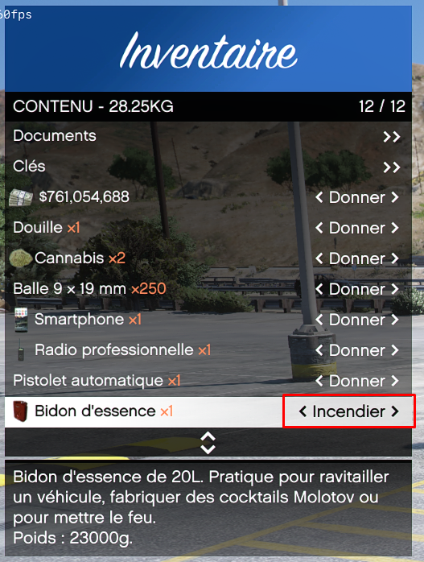

# Les incendies

> Auteur de la page: Thomas.

---

## Déclenchement d'un incendie

Pour déclencher un incendie, il vous suffit d'avoir un `bidon d'essence` et un `briquet` dans votre inventaire puis de cliquer sur l'option `Incendier` du `bidon d'essence`.

L'incendie démarrera à l'endroit où vous vous trouvez. Il est donc important de s'éloigner rapidement pour ne pas être brûlé.

> [!NOTE]
> Lorsque vous déclenchez un incendie, le bidon d'essence sera déposé au sol.

## Incendie de véhicule

Pour déclecher un incendie de véhicule, il vous suffit tout simplement de le faire exploser. Une fois le véhicule explosé, un incendie se déclenchera automatiquement.

## Les cocktails Molotov

Losque vous lancez un cocktail Molotov, un petit incendie débutera à l'endroit où le cocktail Molotov a explosé.

## Risques

Lorsqu'un incendie se déclare un appel est automatiquement envoyé aux pompiers ainsi qu'à la police.

