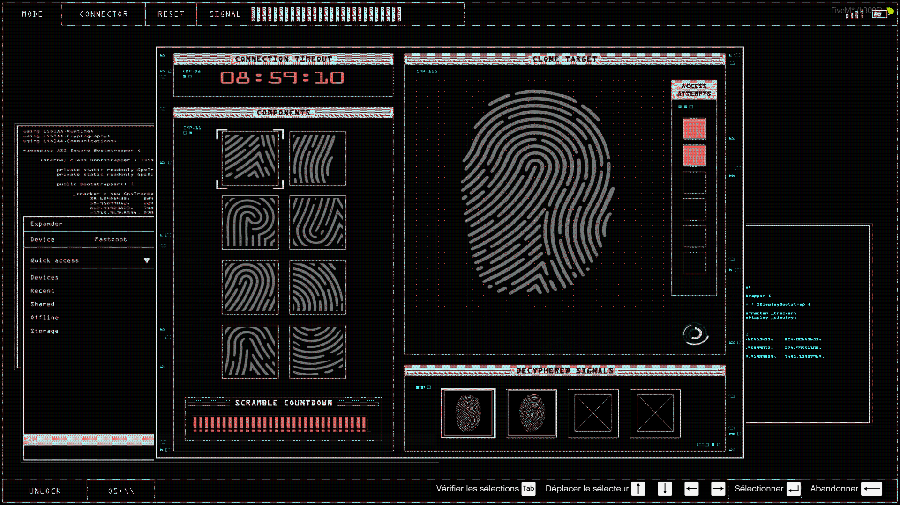

# Piratage d'alarme

> Auteur de la page: Lorr'and Maps.

---
## Introduction

Le piratage d'alarme est une action qui permet de désactiver une alarme sans avoir l'accès à son boitier. Cette action est illégale.

> [!ATTENTION] Avant toute chose, assurez-vous d'avoir bien le bon nombre de policiers en service `Via radial menu`. 
## Prérequis

Pour pouvoir pirater une alarme, il faut avoir impérativement une carte de piratage. Cet outil peut être acheté dans les magasins d'équipements. Leur localisation est achetable via l'informateur. 

## Procédure

Pour pirater une alarme, il faut se placer devant celle-ci et utiliser la carte électronique de piratage, un "mini-jeu" va apparaître.
Vous n'avez que très peu de temps pour trouver l'emplacement du boîtier d'alarme avant que celle-ci se déclenche. 

Une fois le "mini-jeu" réussi, l'alarme sera désactivée.

## Risques

L'alarme peut se déclencher si vous ne trouvez pas le boîtier à temps. Un appel à la police sera effectué, ainsi que la sirène se mettra à retentir.