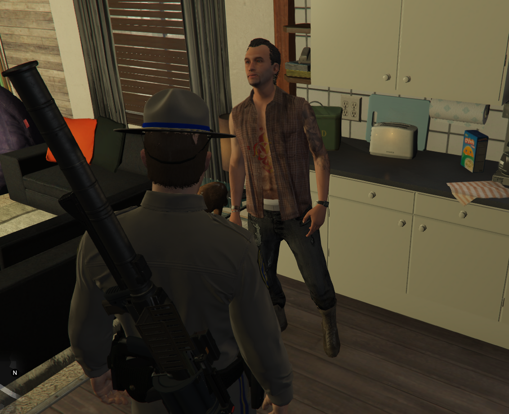
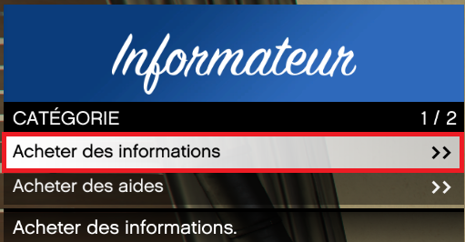
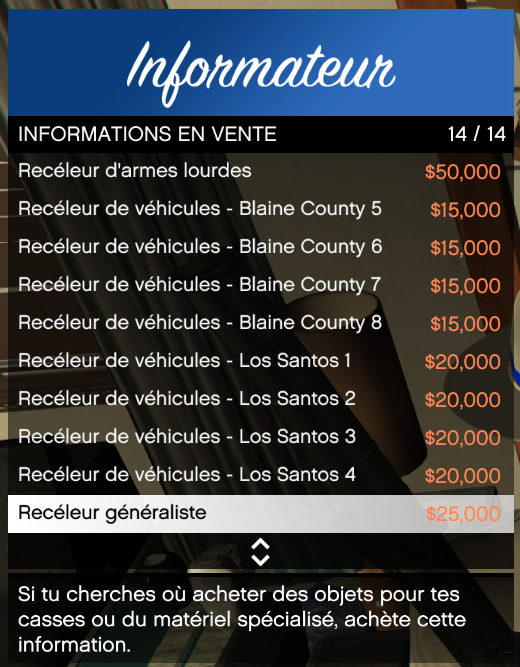
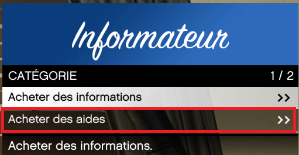
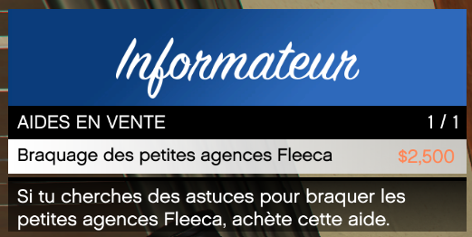
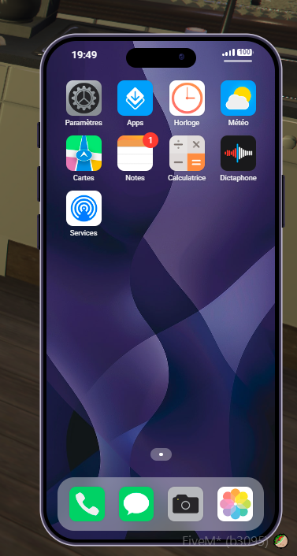
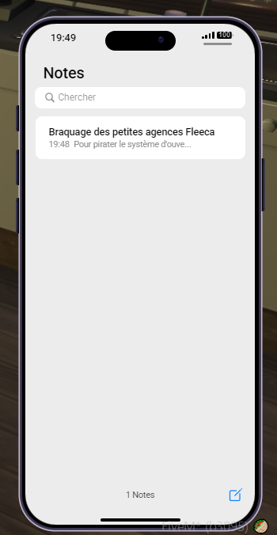

# Informateur Dark
		
> Auteur de la page : Lorr’andMaps.

## Introduction

Il est possible de récupérer auprès d’un informateur PNJ des informations à propos de nombreuses choses disponibles dans le dark. 

> [!ATTENTION] Pour bénéficier d'un informateur, vous devez faire partie d'une organisation/gang. Vous pouvez trouvez le moyen de créer une organisation/gang. Vous pourrez trouver le moyen de créer une de ces entités [ici](https://docs.sadoj-rp.fr/#/life/rules/dark?id=cr%c3%a9ation-dorganisation). 

### Acheter les informations/aides

Vous pourrez retrouver votre informateur dans différents endroits suivant l'organisation/gang rejoint. 
* Pour les Organisations il est régulièrement disponible dans une planque appartenant à celle-ci. 
* Pour les Gangs, il sera disponible dans la zone où est basé le gang. 

Une fois devant, il vous suffira d'ouvrir son menu grâce à votre touche `e`. 
Il sera disponible d'y acheter deux choses, des `informations` et des `aides`. 

#### Les informations. 

Vous y retrouverez différentes infos achetables à différents prix. 
> [!ATTENTION] Suivant le type d'organisation/gang, vous ne retrouverez que certaines informations. 

#### Les aides. 

Vous y retrouverez certaines aides achetables vous permettant de récupérer des informations par rapport à des actions possibles sur le serveur. 

### Recevoir les informations/aides. 

Une fois l'information achetée, vous recevrez sur votre téléphone, le message de l'informateur dans l'onglet `note`. 

En ouvrant cet onglet, vous pourrez lire l'information souhaitée. 

Évidemment, à vous d'aller la lire ensuite hehe ^^ ! 