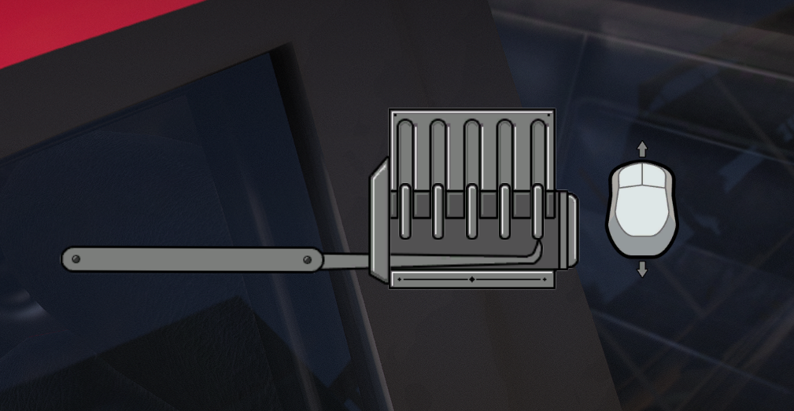
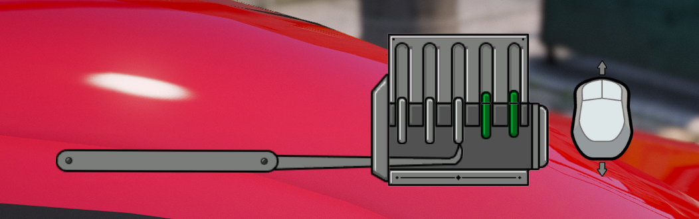

# Crochetage d'un véhicule

> Auteur de la page: Thomas.

---

## Introduction

Le crochetage d'un véhicule est une action qui permet de déverrouiller un véhicule sans avoir la clé. Cette action est illégale.

## Prérequis

Pour pouvoir crocheter un véhicule, il faut avoir au minimum un "outil de crochetage" dans son inventaire. Cet outil peut être acheté dans les magasins de bricolage.

## Procédure

> [!ATTENTION] Avant toute chose, assurez-vous d'avoir bien lu et compris le [règlement](life/rules/dark?id=vol-et-trafic-de-véhicules). En cas de non respect de ce règlement, vous vous exposez à des sanctions.

Pour crocheter un véhicule, il faut se placer à côté d'un véhicule et utiliser l'outil de crochetage. Une fois l'outil utilisé, un "mini-jeu" va apparaître.

Le but est de positionner la goupille dans la zone verte. Pour cela, il faut utiliser le mouvement de la souris. Une fois la goupille dans la zone verte, il faudra maintenir confirmer le positionnement. Si la goupille dépasse de la zone verte, l'outil de crochetage peut se casser.

Une fois que toutes les goupilles sont positionnées, le véhicule est déverrouillé.

## Risques

L'alarme du véhicule peut se déclencher. De façon aléatoire, un appel à la police sera effectué, si la police est appelée, le vehicule sera automatiquement signalé comme volé sur le MDT.

