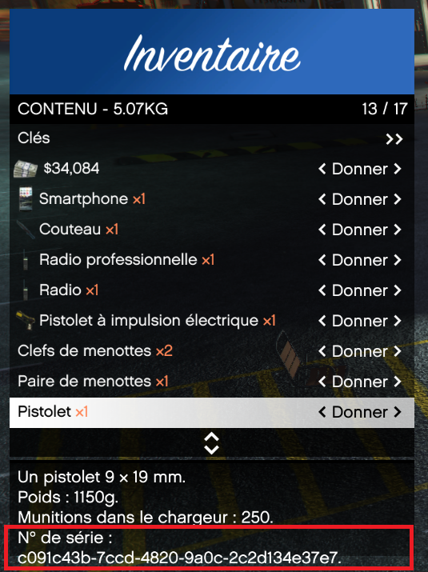
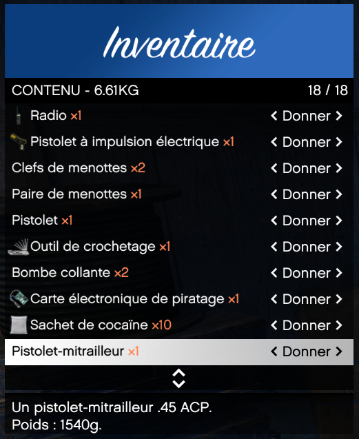

# Achat Armes Non Enregistrées
		
> Auteur de la page : Lorr’andMaps.

## Fonctionnement

> [!ATTENTION] Le port d'armes non enregistrées est illégal. Des poursuites pourront être lancées à votre égard si vous êtes arrêté en possession d’une d’entre elles.

Il vous est possible d’acheter des armes non enregistrées afin de vous en servir pour vos actions illégales futures. 
Des organisations de joueurs se partagent le business, il vous sera possible de prendre contact avec eux via le `BlackMarket`. 

> [!NOTE] Pour vérifier si une arme est enregistrée ou non, il vous suffira d'ouvrir votre inventaire `F2`, et de constater la présence ou non du numéro de série. 

