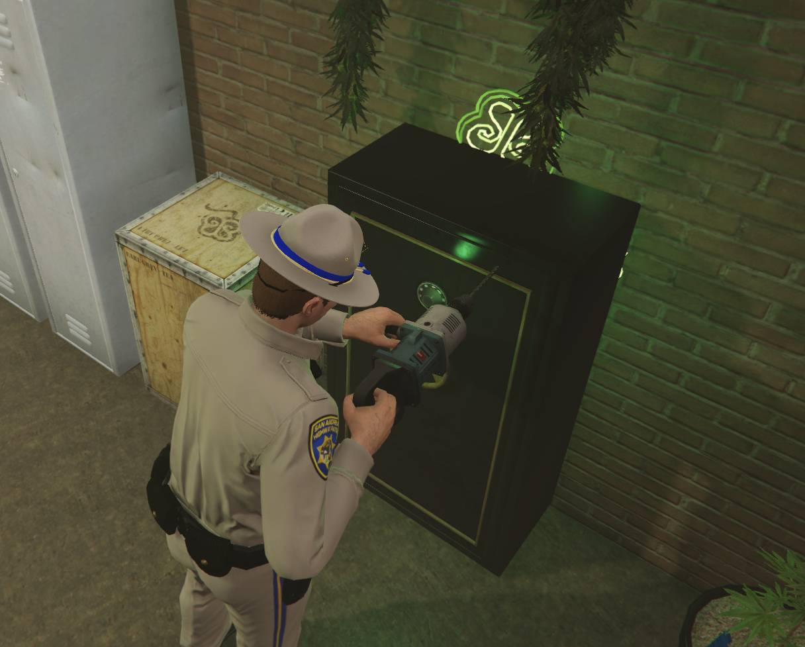
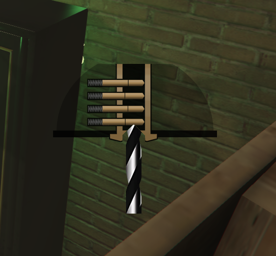

# Perçage de coffre

> Auteur de la page: Lorr'and Maps.

---
## Introduction

Le perçage d'un coffre est une action qui permet de déverrouiller un coffre sans avoir la clé. Cette action est illégale.

## Prérequis

Pour pouvoir percer un coffre, il faut avoir au minimum une "perceuse" dans son inventaire ainsi qu'un foret. Il existe différents types de foret qui agissent sur la vitesse de perçage ainsi que leur résistance à la température. Ces outils peuvent être achetés dans les magasins de bricolage.

## Procédure
> [!ATTENTION] Avant toute chose, assurez-vous d'avoir bien le bon nombre de policier en service `Via radial menu`.

Pour perçer un coffre, il faut se placer devant celui-ci et appuyer sur `E`, et sélectionner l'action `percer le coffre` un "mini-jeu" va apparaître.

Le but est de perer les quatres goupilles. Pour cela, il faut utiliser le clic de la souris. Attention, il faut surveiller la couleur du foret, si celui-ci devient trop rouge, il va casser et arrêter le perçage. 

Une fois que toutes les goupilles sont percées, le coffre est déverrouillé.