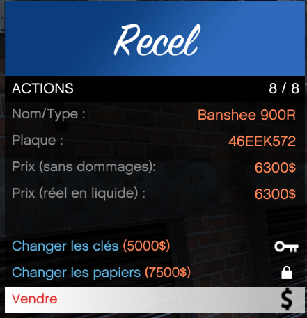

# Receleur de véhicule

> Auteur de la page: Thomas.

---

## Introduction

Le receleur de véhicule vous permet de vendre, d'obtenir les clés d'un ou les papier d'un véhicule volé. Uniquement les membres de Gangs et les membres d'une organisation peuvent accéder à cette fonctionnalité.

> [!NOTE]
> Certains véhicules comme les véhicules des services d'urgence ne sont pas acceptés par le receleur.

## La vente d'un véhicule

Pour vendre un véhicule, il vous suffit de vous rendre au receleur et d'intéragir. Un menu s'ouvrira et l'option de vente sera disponible.

Le prix de vente d'un véhicule est de 50% de sa valeur d'achat, le prix de vente poura être réduit de 2 façons différentes:
- Si le véhicule est endommagé. (reduction en fonction des dégats)
- Si le véhicule n'a pas été crocheté. (-20%)

Si le véhicule que vous essayez de vendre n'est pas un véhicule joueur, le prix sera calculé en fonction de la catégorie du véhicule (Compacts, SUV, Sports, etc...)

## Obtenir les clés d'un véhicule
<!--
Dans le menu du receleur, un bouton "Changer les clés" est disponible. Le prix de cette action est calculé en fonction de la catégorie du véhicule (Compacts, SUV, Sports, etc...)

 -->

Soon

## Obtenir les papiers d'un véhicule

Soon

{docsify-updated}