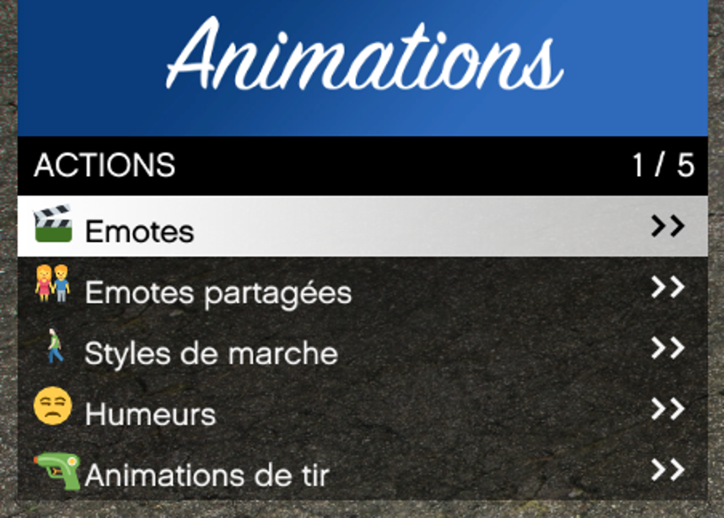
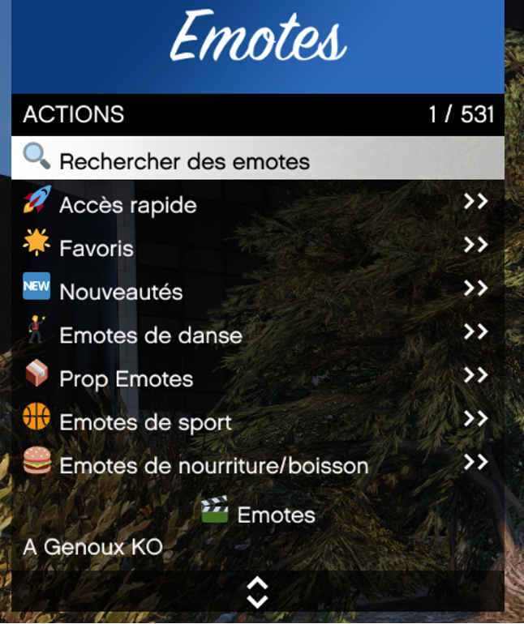
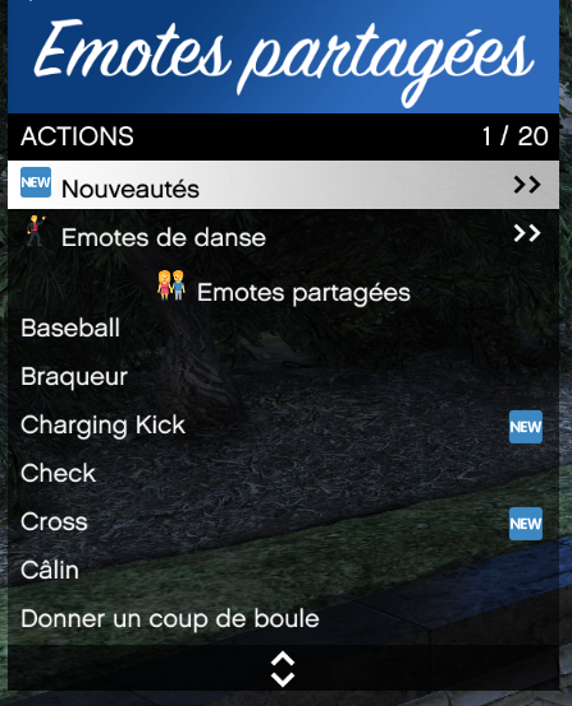

# Animation

> Auteur de la page: LorrandMaps/Magic

---
## Introduction

Le menu `Animation` vous permet de réaliser de multiples actions avec votre personnage. Pour ouvrir le menu d’animation, il faut appuyer sur votre touche `F10`, on y retrouve ensuite 5 catégories.

> [!NOTE] Vous pourrez visualiser vos animations, démarches et émotes à droite de votre écran. 

# Je retrouve quoi ?

- Emote
    * Dans la catégorie emotes vous retrouverez toutes les animations possibles sur le Life. Vous avez la possibilité de rechercher celles-ci avec leurs noms.

- Accès rapide
    * Vous avez la possibilité d’enregistrer vos émotes dans `Accès rapide`, sélectionner simplement l’émote souhaitée et vous pourrez l'utiliser grâce aux touches `1` à `9` de votre pavé numérique (Touche modifiable).

- Favoris
    * Vous avez la possibilité d’enregistrer vos émotes dans la catégorie `Favoris`, pour ce faire descendez sur l’émote souhaitée et appuyez sur votre touche `Shift` + `Entrée`.

- Nouveautés
    * Vous retrouverez ici toutes les émotes récemments ajoutées sur le serveur Life

## Les 4 catégories d’Emotes

Ces 4 catégories regroupent toutes les émotes selon le thème de celle-ci, il y a la danse, les props, les sports et enfin la        nourriture et les boissons.

- Emote Partagées
    * Vous retrouverez ici toutes les émotes que vous pouvez utiliser avec/sur les autres joueurs, aussi bien des émotes de danse que des actions telles qu’un câlin.

- Animation général
    * Vous pouvez par ce menu d’animation changer la façon de marcher de votre personnage, l’expression/humeur de son visage ainsi que sa façon de tirer.