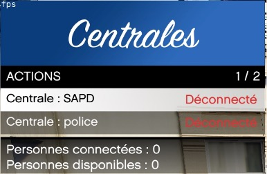
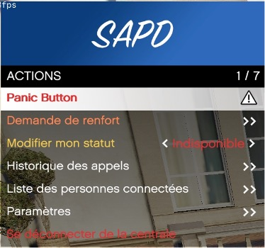

## Centrale d'appel

> Auteur de la page: Lorr'and Maps/Magic.

---

## Fonctionnement

Pour accéder au menu `Centrales`, appuyez sur la touche `F4` (modifiable dans vos paramètres).
Ce menu vous permet de visualiser le nombre de personnes actuellement connectées à la centrale que vous souhaitez rejoindre.
Pour accéder au menu de connexion, il vous suffit d’appuyer sur la touche `Entrée`. 
Une fois dans le menu, appuyez également sur la touche `Entrée` pour vous connecter à la centrale.

Une fois connecté à la centrale, vous accéderez à un menu offrant différentes options en fonction de la centrale à laquelle vous êtes relié. Par exemple, pour les policiers, il est possible d’utiliser un `Panic Button` ou de faire une `Demande de renfort`, ce qui n’est pas disponible pour les centrales des entreprises, par exemple.

