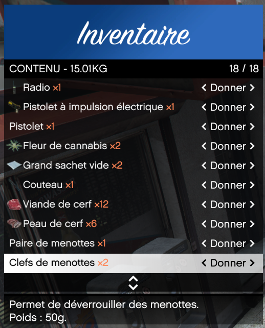
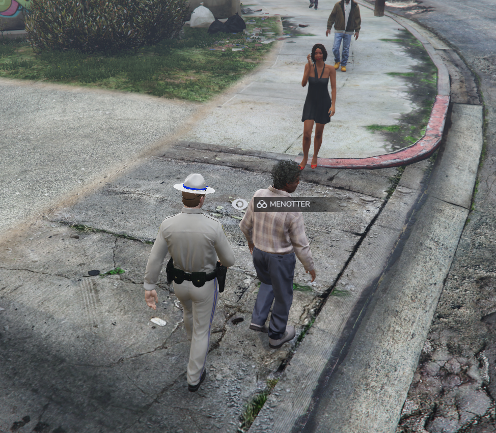
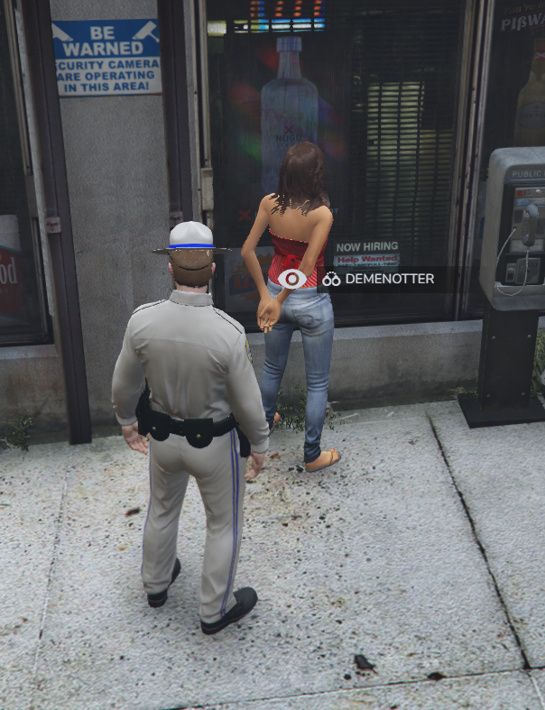

# Menottes
		
> Auteur de la page : Lorr’andMaps.

## Fonctionnement
Il est possible de menotter des joueurs/PNJ. Pour réussir cette tâche, il est indispensable de posséder une `paire de menottes` et des `clés`.

Il vous suffira de regarder la personne via votre `alt`, l’action `menotter` vous sera proposée. 

Évidemment il sera aussi possible de démenotter, pour cela, même principe, regarder via `alt` le joueur, et l’action `démenotter` vous sera proposée. 

> [!NOTE] En tant que joueur menotté, vous aurez accès uniquement qu'aux `F9` pour retirer un casque/masque par exemple et `F10` pour ce qui est des animations. 