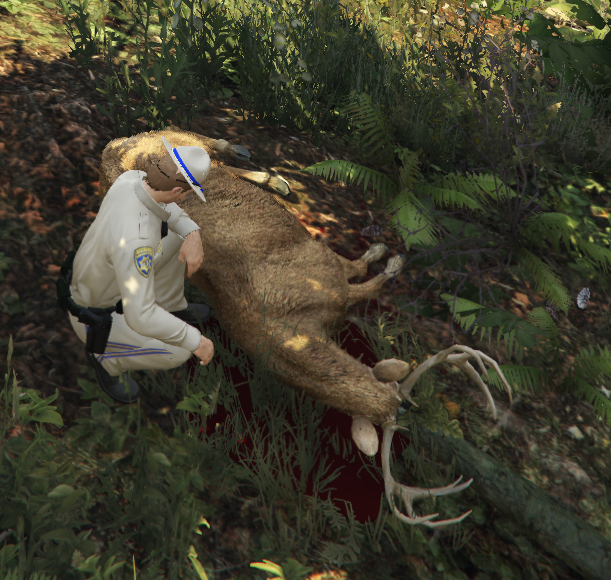

# Chasse et Braconnage
		
> Auteur de la page : Lorr’andMaps.

## Avant tout 

Vous devrez passer le `permis de chasse` pour pouvoir chasser légalement. À vous de trouver les contacts pour. 
Autrement, il vous sera possible de faire du `braconnage`, attention, cela est `illégal`.  

## Fonctionnement

> [!ATTENTION] Un certain nombre de policiers est nécessaire pour pouvoir chasser librement. 
 
Il vous est possible de chasser, le fonctionnement est plutôt simple. 
Il vous suffira de tirer sur différents animaux. Une fois l’animal abattu, vous pourrez, en regardant l’animal via `alt`, le dépecer. 
Une fois l’animal disparu, vous pourrez regarder dans votre inventaire `F2` la quantité de peau et de viande récupérées. 

## Taxidermiste 

Vous trouverez une boutique taxidermiste où il vous sera possible de vendre la peau des animaux récupérés. 
Une fois sur place, il vous suffira de suivre les informations suivantes, `E` pour ouvrir le menu de la boutique, `vendre`, sélectionner le type de peau que vous souhaitez vendre (ex: `peau de cerf`) et enfin, sélectionner la quantité (ex: `6`). 
Vous recevrez votre argent en liquide. 

## Boucherie on the bones
	
Vous trouverez une boucherie où il vous sera possible de vendre la viande des animaux récupérés. 
Une fois sur place, il vous suffira de suivre les informations suivantes, `E` pour ouvrir le menu de la boucherie, `vendre`, sélectionner le type de peau que vous souhaitez vendre (ex : `viande de cerf`) et enfin, sélectionner la quantité 
(ex: `12`). 
Vous recevrez votre argent en liquide. 

