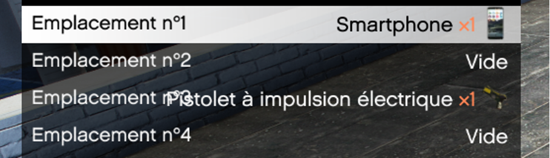
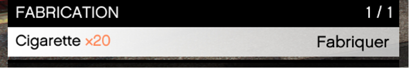
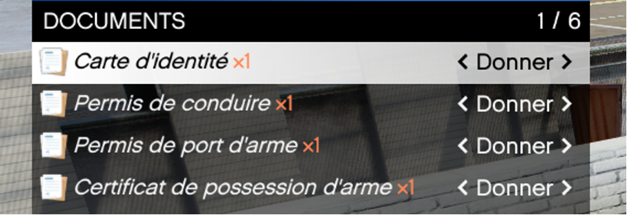

# Inventaire

> Auteur de la page: Lorr'and Maps/Magic.

---

## Introduction

L'inventaire est l'équivalent de vos poches, vous voyez les objets présents sur vous ainsi qu’une description de chacun en dessous et le poids total présent sur votre personnage en haut. Ce poids influe sur votre vitesse de course. 
Pour ouvrir votre inventaire, il faut appuyer sur la touche `F2`, un menu va s'ouvrir. 

## Quoi d'autres ?

Il contient 4 catégories supplémentaires :

* Emplacement Rapide
    - Pour les emplacements rapides, il vous suffit de sélectionner l’objet souhaité 
Il deviendra alors accessible par les touches `1` à `0` de votre clavier (touche modifiable) selon l’emplacement attribué.

* Fabrication
    - Pour la fabrication, vous pouvez par exemple fabriquer des cigarettes en ayant sur vous les objets Paquets de tabac et Feuille à rouler.

Vous pouvez aussi séparer les objets vendues en lot tel que les sachets de croissant ou bien les bouteilles d’alcool.

Pour certaines fabrications il vous faudra être à côté d’un objet spécifique,
Ex : Pour remplir une bouteille d’air vous devez être à côté d’un compresseur.

* Documents
    -  Dans la catégorie document, vous y retrouverez tous les documents principaux tel que 
votre carte d’identité et vos permis/licenses. 

* Clé
    - Dans la catégorie `clés`, vous retrouverez les clés de chacun de vos véhicules avec la plaque correspondante.

* Équipements des Armes
    - Il est possible de changer les équipements de vos armes par l’inventaire avec l’option `Inspecter`.

Une nouvelle interface s’ouvre, vous pouvez y ajouter les équipements (en les ayant dans votre inventaire) ou bien les retirer.

