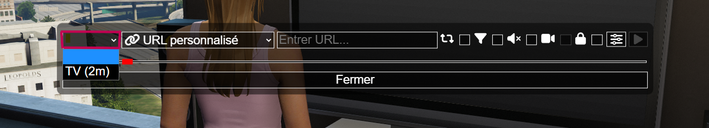
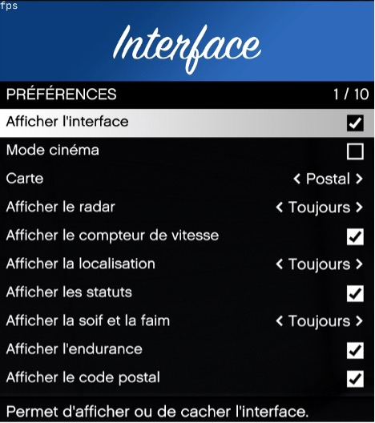

# Menu Radial

> Auteur de la page: Lorr'and Maps/Magic.

---

## Introduction

Le menu radial se présente sous la forme d’un cercle. Pour y avoir accès, il faut appuyer sur votre touche `X`, vous y retrouverez plusieurs catégories.

## Je retrouve quoi ?

- Catégorie Musique

Cette catégorie vous permet d’accéder à l’interface de musique. Par la première icône, vous pourrez choisir la sortie de votre son en jeu, ici il y a l’exemple de la TV mais cela marche également pour les boombox et les véhicules.

La deuxième icône vous permet de choisir quelle musique vous souhaitez écouter, il est possible de mettre une chaîne de radio en dépliant l’icône ou un `URL` personnalisé. A sa droite on retrouve l’interface où copier l’URL d’une musique ou d’une vidéo.

Enfin, on retrouve les icônes permettant de gérer le son, telles que le bouton pause, mettre le son en boucle ou couper le son. Vous pouvez également gérer le volume avec la barre en dessous.

- Catégorie Animation

Vous pouvez ici commencer une animation avec le bouton Jouer une animation et en rentrant le nom, ou bien utiliser la touche `F10` de votre clavier qui ouvre le menu animation aussi présent ici. Il est possible d’arrêter cette animation avec le bouton `Arrêter l’animation` ou bien la touche  `²`  de votre clavier. L’animation pour lever les mains est quant à elle seulement présente dans cette catégorie.

- Catégorie Métier

Cette catégorie vous sera présentée selon votre métier de façon HRP avec les membres de l’entreprise, prenez l’initiative de leur demander à quoi servent les fonctions présentes dedans.

- Catégorie Physiologie

Vous retrouverez ici, la faim et la soif de votre personnage (aussi disponible en dessous de votre mini map), la satiété et son endurance.

## Catégorie Supplémentaire

- Action Dark

L’onglet `Action Dark` permet aux joueurs impliqués dans le Dark RP de connaître les actions possibles à réaliser en jeu, en fonction de la présence ou non de la police sur le serveur Life.

- Interface

L'onglet Interface permet de gérer l’ensemble des éléments affichés sur votre écran ainsi que sur votre map.

- Me

L’onglet Me permet d’écrire un message qui sera retranscrit comme une action pour les autres joueurs. 
   * Ex : Prends un stylo / Fais un clin d’oeil

- Position de l’arme

L’onglet Position d'armes vous permet de choisir si votre arme est placée à l’avant ou à l’arrière de votre personnage quand vous ne l’avez pas en main.

- Code Postal

L’onglet Code Postal vous permet de mettre un point automatiquement sur votre map grâce au code postal du lieu afin de vous créer un itinéraire.

- Appel Anonyme

L'option Appel anonyme permet de contacter la centrale de la police, des pompiers, des EMS ou des journalistes tout en restant anonyme. Cela peut être utilisé, par exemple, pour simuler un PNJ ayant remarqué quelque chose de suspect.

