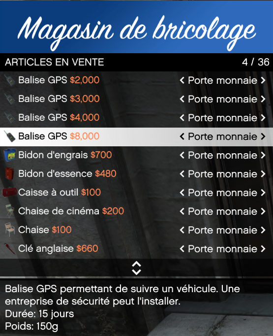
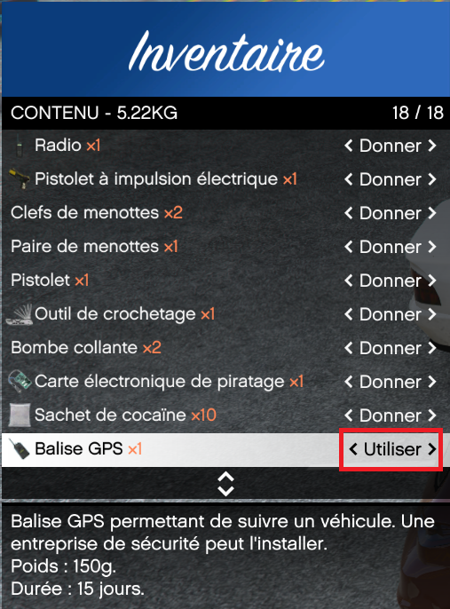
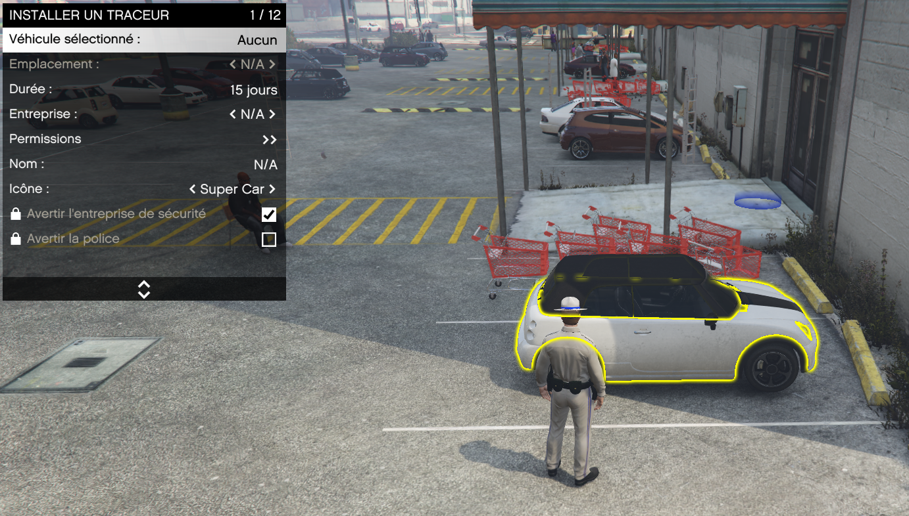
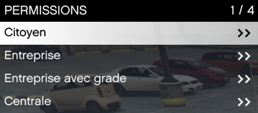
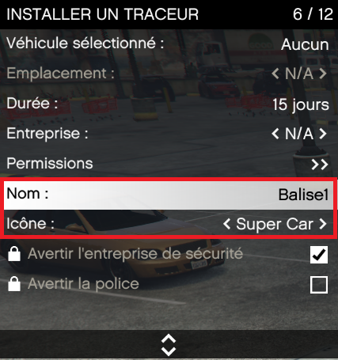
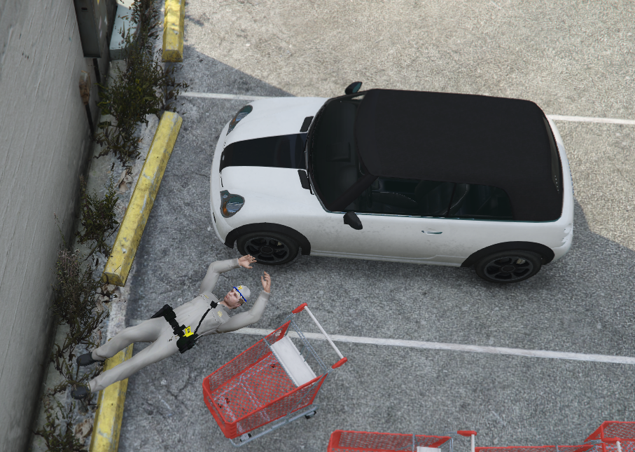

# Installation de balise GPS

> Auteur de la page: Lorr'and Maps.

---
## Introduction

La pose de balise est une action qui permet de suivre la position d’un véhicule sans que son propriétaire soit au courant. Cette action est illégale. 

## Prérequis

Pour pouvoir poser une balise il vous faut vous munir d’une balise disponible dans les magasins de bricolage. Il existe différentes balises, cela agit sur la durée de l’émetteur. 

## Procédure

Pour poser la balise sur un véhicule, il faut se placer à côté de celui-ci et utiliser la balise. 

Une fois la balise utilisée, vous devrez sélectionner le véhicule devant vous. 

Ensuite, vous devrez remplir les champs de façon à ce que les personnes que vous souhaitez puissent voir la balise active. 

Ainsi que le type de marqueur, son nom et son emplacement sur le véhicule. 

Une fois tout cela effectué, vous vous glisserez sous le véhicule de façon à installer la balise à l’endroit choisi. 

## Risques
Il est possible que la balise soit découverte par son propriétaire, si cela est le cas, des poursuites pourraient être entrepris à votre encontre. 