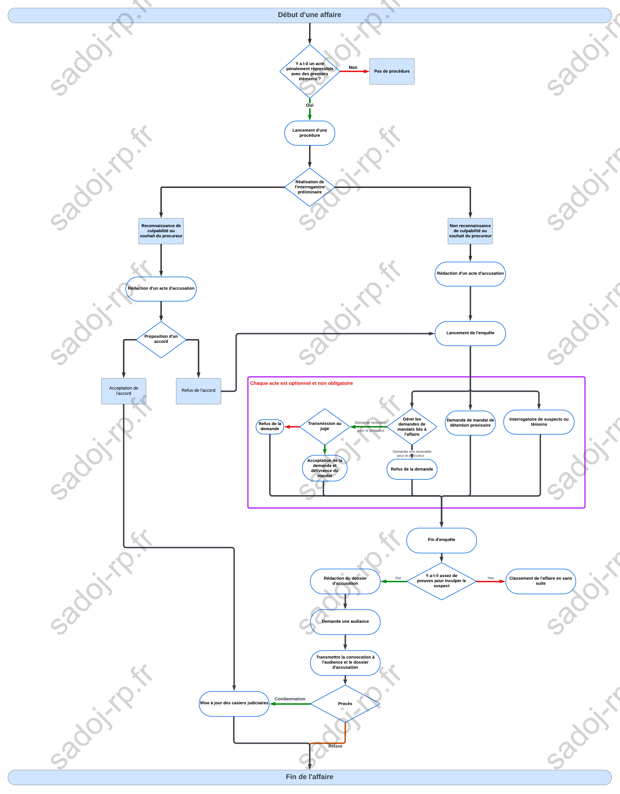

# Apprendre le RP Justice au sein de la SADoJ
  

> *Rédigé par Roni*

 ---

## Préambule :

Bienvenue dans l'univers fascinant de la Justice sur le serveur RP ! Ici, tu n'as pas besoin d'un doctorat en droit, ni de mémoriser des tomes de procédures pénales ou de codes pénaux pour t'amuser. Non, tout ce qu'il te faut, c'est un peu de curiosité, une pincée de bon sens, et une bonne dose d'humour.

Tenté par l'aventure juridique ? Excellent choix ! Tu es au bon endroit. Nous allons te guider pas à pas à travers chaque étape, en décodant les subtilités de notre système. Que tu sois un avocat en herbe, un juge sévère mais juste, ou même un simple citoyen avec un penchant pour les affaires judiciaires, nous avons tout ce qu'il te faut pour briller (ou trébucher gracieusement) dans ce rôle.

Rappelle-toi, échouer fait partie du jeu. Après tout, où serait le fun sans quelques gaffes mémorables et quelques rires bien sentis ? Donc, attache ta ceinture, ajuste ta robe de magistrat, et prépare-toi à plonger dans le monde hilarant et parfois absurde de la RP Justice. C'est parti pour l'aventure !

---
## Début d'une affaire

### Lancement d'une procédure

#### Réalisation de l'interrogatoire préliminaire

Ah, l'interrogatoire préliminaire, c'est un peu comme être le maître de cérémonie dans un spectacle de magie où tu dois découvrir tous les tours de ton suspect.

Imagine-toi, un mélange de Sherlock Holmes et de Columbo, avec un soupçon d'agacement et beaucoup de caféine dans les veines. Tu entres dans la salle d'interrogatoire avec un regard perçant, prêt à démêler le vrai du faux.

Tu t'assois en face du suspect, essayant de paraître à la fois amical et implacable. Tu commences par les questions de base, presque comme un hôte bienveillant à un dîner :

---
 > "Alors, racontez-moi, où étiez-vous le soir du 12 juin ?"
 ---   
Tu sais que les premières réponses seront probablement banales, mais tu écoutes attentivement, notant chaque détail, chaque hésitation. C'est comme jouer au poker, tu dois garder ton visage impassible, tout en guettant le moindre tic nerveux.

Puis, tu sors un dossier épais, un peu comme un magicien qui sortirait un lapin de son chapeau. À ce moment-là, tu sais que le véritable show commence. Avec un sourire en coin, tu poses la question-clé, celle qui pourrait faire basculer l'interrogatoire :

---

> "Dites-moi, pourquoi avez-vous acheté 10 litres de peinture rouge le jour de la disparition de votre voisin ?"

 ---
Tu observes le suspect se tortiller sur sa chaise, cherchant désespérément une explication crédible. Pour toi, c'est le moment où tu dois rester impassible, tout en notant chaque réaction. C'est un jeu d'échecs, et chaque réponse du suspect est un mouvement sur l'échiquier.

En réalité, tu dois jongler entre plusieurs rôles : tu es à la fois le procureur méticuleux, le psychologue amateur, et parfois, l'acteur qui joue la comédie pour obtenir une confession. Tout en sirotant ton café froid, tu sais que chaque mot, chaque geste peut te rapprocher de la vérité. Et quand tu sors de la salle d'interrogatoire, tu espères avoir fait un pas de plus vers la résolution de l'affaire, prêt à écrire le prochain chapitre de cette enquête palpitante.

Bref, pour toi, l'interrogatoire préliminaire, c'est comme être sur scène dans un thriller psychologique, avec une seule mission : découvrir la vérité, une question à la fois.

Comme tu l’as compris, cet interrogatoire est important, je te conseille de l'enregistrer et/ou de rédiger un rapport d’interrogatoire. ([Cf. exemple de rapport d'interrogatoire](https://docs.google.com/document/d/e/2PACX-1vQoff-AyLWoZP70jnQQMJzGq5XMZOukZHssp_BIKqEwlXc0KKXg_2_oHHuVl0y7SmgYTOCPWjMW9yCG/pub)). Je te conseille de le faire à chaque interrogatoire ou au moins sur les grosses affaires.

Cependant, cet interrogatoire peut-être réalisé sans la présence du procureur par les agents des forces de l’ordre.

--- 

### Choix de la voie judiciaire

À la suite de l’entretien préliminaire, tu te retrouves à la croisée des chemins, avec trois choix qui s’offrent à toi. C’est un peu comme être à l’orée d’une forêt dense, avec chaque sentier promettant son lot d’aventures et de défis. Voici tes options : proposer un accord, ouvrir une enquête et aller au procès, ou, si les éléments initiaux sont peu probants, annuler l’affaire et la classer sans suite.

#### 1. Proposer un accord

Si tu choisis cette voie, tu endosses le rôle du négociateur habile. L’avantage ici, surtout si le suspect reconnaît les faits, est la rapidité du processus : une soirée de discussions et l’affaire est pliée, comme un tour de magie bien exécuté. C’est un peu comme conclure une partie de poker avec une main gagnante dès le premier tour. Tout le monde gagne du temps, et la justice est rendue efficacement.

#### 2. Ouvrir une enquête et aller au procès

Si le suspect ne reconnaît pas les faits ou si les faits sont graves, ouvrir une enquête et aller au procès devient la meilleure option. C’est ici que tu te transformes en un intrépide détective, explorant chaque recoin sombre de l’affaire. Le procès est mieux vu dans ces cas, offrant une scène épique où la vérité doit triompher. Cette voie est un marathon judiciaire, où chaque détail compte, chaque témoignage est crucial.

#### 3. Annuler l’affaire et la classer sans suite

Cependant, si les éléments initiaux sont peu probants, tu as toujours la possibilité d’annuler l’affaire et de la classer sans suite. C’est comme décider de plier le jeu avant même de commencer une partie qui semble perdue d’avance. Parfois, la sagesse réside dans la reconnaissance qu’il n’y a pas assez de cartes pour continuer.

#### Une décision au feeling

Mais souviens-toi, il n’y a ni bonne ni mauvaise décision. C’est souvent une question de feeling, de flair judiciaire. N’oublie jamais que face à toi, ce sont des joueurs que tu as, et que le but est aussi de rendre le processus juste et équilibré, sans chercher à bloquer un joueur pendant des siècles. Ton objectif est la vérité, pas la punition excessive.

#### Revenir à l’accord

Même si tu choisis de passer par la voie du procès, rien ne t’empêche de revenir sur la voie de l’accord à tout moment. Cette flexibilité est une carte maîtresse à garder en main, surtout si des doutes surgissent sur l’issue du procès. Utiliser l’accord comme une sortie de secours peut parfois être la stratégie gagnante, assurant que la justice est servie de manière équitable et efficace.

Bref, quel que soit le chemin que tu choisis, garde à l’esprit que chaque décision est une étape vers la résolution de l’affaire, et que ta mission est de naviguer avec sagesse et équité dans ce labyrinthe judiciaire.

Quelle que soit la voie judiciaire que tu choisis, un certain nombre de documents sont à faire. Nous allons les voir.

  --- 

### L’acte d'accusation ([Cf. exemple d’acte d’accusation](https://docs.google.com/document/d/e/2PACX-1vT7irMXBNRDGSPuo_cDCFnxzLkV0k0375WdtlacYeDKq49MYCkfJGEnk9TraowVt-FTE4jt5ltKgdLB/pub))

L’acte d’accusation, c’est un peu comme la feuille de route de toute procédure judiciaire. Tu dois le rédiger après l’interrogatoire préliminaire ou lorsque les preuves sont aussi solides qu'un roc. Ce document résume les chefs d'accusation contre le suspect, et, comme un bon livre de cuisine, il peut être ajusté plusieurs fois pendant l’enquête.

Maintenant, tu te demandes peut-être : "Comment je fais pour déterminer les chefs d’accusation sans connaître le code pénal sur le bout des doigts ?" Pas de panique ! On ne te demande pas d’être un dictionnaire ambulant. Avec le temps, certains articles te deviendront familiers, comme les paroles de ta chanson préférée. Mais en attendant, après l’interrogatoire, tu fais comme tout bon professionnel : tu ouvres le sommaire du code pénal. En fonction des faits racontés par les forces de l’ordre et des éléments que le suspect t’a donnés, tu sélectionnes les articles pertinents, un peu comme on choisit les ingrédients pour une recette. Et bien sûr, vérifie que ces articles s’appliquent bien à ta situation – après tout, on ne veut pas mélanger les torchons et les serviettes !

N’oublie que les actes d’accusations doivent obligatoirement être envoyés aux **juges**, au **suspect**, aux **forces de l’ordre** ainsi qu’à l’**avocat** le cas échéant. Il doit être envoyé dans les **48h suivant l’arrestation du suspect**.

  #### Proposition d'un accord ([Cf. template d’accord](https://docs.google.com/document/d/e/2PACX-1vTZviRMdEhLzZ5eU1-YmiKzEY3r3qNV-NZHtt0B_rKHJhZmpuoMtzCT2BerYAK0AcMJyxt0o778WF7q/pub))

Tu as choisi de concocter un accord parfait. L'accord, comme on l'a vu, c’est le fast-food de la procédure judiciaire : rapide, efficace, et une fois signé par les parties, l’affaire est close. Pas de retour en arrière, sauf si l’une des parties décide de jouer les mauvais élèves en ne respectant pas ses engagements.

L'accord regroupe les chefs d’accusation, les peines encourues, et la peine proposée par toi (futur procureur 😊). La peine est souvent adoucie ou légèrement modifiée par rapport à ce que dicte le code pénal. On n’est pas là pour charger la mule, car tu veux une procédure rapide. Si tu mets trop de poids dans la balance, le suspect pourrait demander à aller au procès, où il pourrait écoper d’une peine plus légère. L’idée est que les deux parties en sortent gagnantes, mais avec un petit avantage pour nous (côté Procureur, bien sûr).

***Suite => Fin de procédure***

--- 
### L’enquête

Tu as choisi la voie du procès ? Génial, l’enquête est ouverte ! Prépare-toi à jongler avec les demandes des forces de l’ordre pour dénicher de nouvelles preuves. Voici un aperçu des principaux actes, et rassure-toi, aucun n’est obligatoire :

#### L’interrogatoire du suspect ou du témoin

Il se pourrait bien que, dans le cadre de l’enquête, tu aies besoin, ou que les forces de l'ordre aient besoin, de réinterroger le suspect ou un témoin pour valider ou obtenir de nouveaux éléments. Si c’est toi qui t’y colles, fais-le comme lors de l’interrogatoire préliminaire : enregistrement et rapport d’interrogatoire. Plus tu as de biscuits pour ton audience, mieux c’est ! Après tout, qui n’aime pas avoir des munitions en réserve ?

#### Gestion des demandes des forces de l’ordre sur le MDT

Les forces de l’ordre pourraient avoir besoin de mandats pour perquisitionner une maison, analyser le téléphone du suspect, consulter les registres cadastraux, et autres joyeusetés. Toutes ces demandes nécessitent un mandat. Ton rôle est crucial ici : tu dois vérifier la légalité de la demande et les éléments de l’enquête avant de la transmettre au juge. Si tout est en ordre, le juge décidera d’accorder ou non le fameux mandat. Pense à toi comme le gardien de la porte magique des mandats !

#### Demande de détention provisoire

Parfois, le suspect est tellement dangereux que tu veux protéger la société. Dans ce cas, tu peux demander une détention provisoire. Cette procédure est à utiliser avec parcimonie, comme une épice rare dans une recette. Le processus est le même que pour les autres demandes : vérification, avis, transmission au juge. C’est un peu comme jouer à un jeu vidéo, sauf que les conséquences sont réelles.

Bref, tu vas être occupé ! Mais c’est pour ça qu’on est là, non ? Pour faire avancer la justice, une étape à la fois, avec un peu de flair et beaucoup de rigueur. Et qui sait, peut-être qu’un jour tu pourras écrire un best-seller avec toutes tes aventures judiciaires. « Le Procureur : Chroniques d’un Superhéros Judiciaire » – ça a déjà un petit air de succès, non ?

--- 

### Fin de l'enquête et préparation de l'audience

Tu as récolté assez d'éléments ou, au contraire, tu n’as pas assez de preuves contre le suspect ? Il est temps de décider de la fin de l’enquête. Deux choix s’offrent à toi : classer l’affaire sans suite si les éléments à charge sont insuffisants ou préparer le dossier pour l’audience.

#### Le dossier d’audience ([Cf. exemple dossier d’audience](https://docs.google.com/document/d/e/2PACX-1vTU-WXiM07o-ZXEfBCrpRyYkupSjXu3YIq_rC1bbLU7Tz9pamOusqMgQN4nQ3LLH1VW3P85WT5kA6Ai/pub))

Le dossier d’audience, c’est un peu comme le portfolio de ton enquête. Il regroupe tous les éléments que tu as pu collecter : état civil, casier judiciaire du suspect, tous les rapports, toutes les preuves à charge, les chefs d’accusation. C’est le teaser de ta prestation au procès. Plus tu as d’éléments, plus ton procès a des chances de bien se passer. En gros, c’est ton kit de survie judiciaire.

Une fois ton dossier constitué, tu dois l’envoyer au juge pour demander une date d’audience. Une fois que la date est calée, tu dois en avertir le suspect, son avocat, et les potentiels parties civiles (toutes les personnes ayant subi des dommages et souhaitant demander une compensation). C’est un peu comme envoyer des invitations pour une grande fête, sauf que cette fête-là se passe au tribunal !

### Le procès

[Voir article 5 du CPP](life/rp/criminal_procedure_code?id=chapitre-5-le-proc%C3%A8s)

### Fin de la procédure

Tu as réussi, le suspect a signé l’accord ou le juge a rendu son jugement, et la procédure judiciaire est finie. Enfin, presque. Il te reste quelques petites choses à faire. D’abord, tu dois inscrire au MDT la citation que tu viens de signer ou le jugement. C’est crucial pour le suivi de la justice, un peu comme suivre tes séries préférées sans manquer un épisode.

Ensuite, il y a le règlement de la citation. Le suspect a deux choix : soit la payer immédiatement, soit dans les trois semaines suivant l’accord. C’est comme choisir entre un paiement en ligne instantané ou recevoir la facture par la poste, sauf que sans option de livraison gratuite.

Un rôle clé du procureur, peu importe la procédure, c’est de s’assurer que les citations sont payées. Imagine l’image de la justice si on ne vérifiait pas si les décisions étaient respectées. Ce serait comme organiser un concours de cuisine et ne jamais goûter les plats. On finirait avec des jugements en souffrance et des suspects en vadrouille, et personne ne veut ça !

---

## Fin de l'affaire

---

## Schéma récapitulatif d'une affaire

