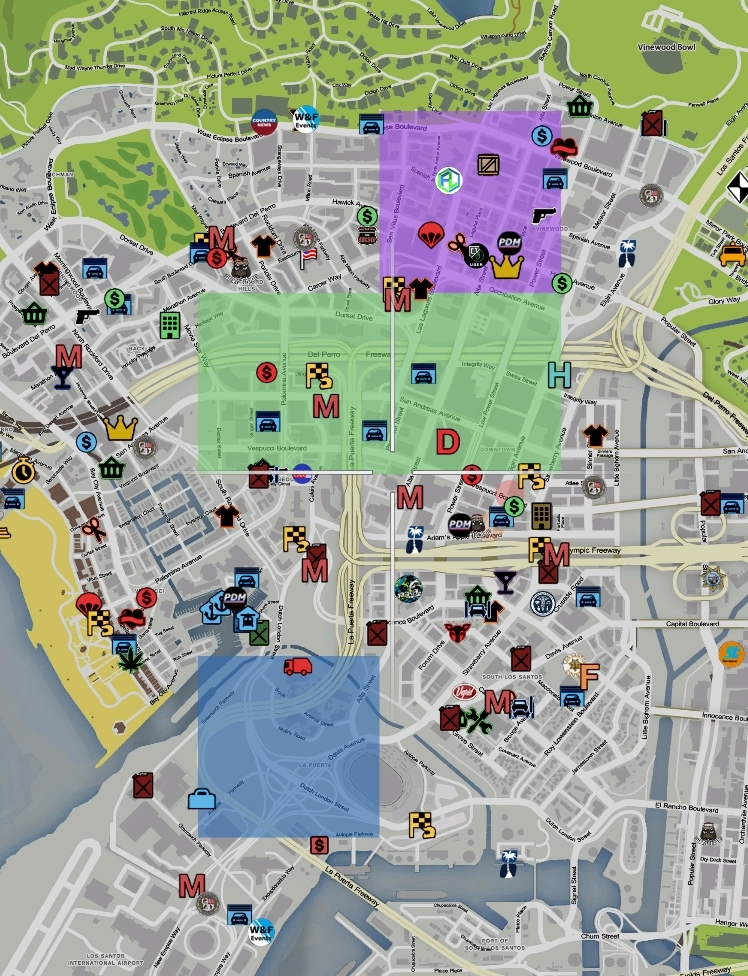

# Guerres de territoires

> Auteur de la page: Pierre.

---

## Guerres de territoires ?

Les organisations & gang ont la possiblité de participer aux "guerres de territoires". Il ne s'agit pas réellement d'une guerre, mais plutôt d'influence sur la population. Les actions sur les joueurs n'ont pas vocation à avoir un impact sur ce système.

L'objectif est donc, pour une organisation, d'avoir un maximum d'influence pour étendre son activité ou pour, par exemple, démontrer sa puissance et sa supériorité. Il est toutefois possible que dans le futur, contrôler une ou des zones soit requis pour faire certaines actions.

Chaque organisation ou gang qui participe à une couleur qui lui est propre, il n'est, en aucun cas, possible de savoir directement **en rôle-play** que telle couleur corrrespond à tel groupe.
*(Il est évident que vous allez par exemple directement associé le vert aux Famillies, mais parce que vous connaissez leur couleur et non parce que c'est écrit en hors rôle-play quelque part.)*

La participation au système pour une organisation ou un gang n'est pas obligatoire *(par exemple un mafia discrète ne cherche pas forcément l'influence sur la population)*.

## À quoi cela ressemble ?

Il est possible pour les personnes ayant accès (membres d'une organisation, d'un gang ou acteurs de la Justice) d'activé la visibilité des zones d'influence via le menu F7.

Les organisations y ont accès pour des raisons évidentes, cependant la Justice y a accès pour simuler le travail de personnages non-joueurs (services anti-gang, services de renseignements, etc...).

Il apparaît ainsi sur la carte, la couleur de l'organisation ou du gang qui contrôle un territoire. S'il n'y a rien, aucun groupe ne contrôle la zone.

## Comment cela fonctionne ?

Pour contrôler une zone, il faut avoir un certain nombre de points. Aucun chiffre ne sera précisé ici, l'objectif est de découvrir par soi-même et de trouver **votre** stratégie.

N'oubliez pas que votre stratégie et vos actions doivent être cohérente avec le lore et le type de votre organisation.

Il est à savoir que chaque point (négatif ou positif) a une durée de validité, il est donc nécessaire de conserver une activité régulière dans une zone pour la conserver.

Certaines actions provoquent un **effet de rayon**, cela signifie que l'action à un impact sur toutes les zones situées à moins de 100 mètres de l'action. Seules les actions importantes ou les actions possibles que dans très peu d'endroits provoquent cet effet.

### Gagner des points

Pour gagner des points, il faut effectuer certaines actions qui vont augmenter votre influence auprès de la population.

Plus une action est importante, plus elle apportera de points et sera valide plus longtemps.

Si vous êtes dans plusieurs organisations, toutes vos organisations gagnent des points. Si votre organisation n'est pas dans le système ou si vous êtes dans aucune organisation, votre action aura aucune influence sur le système.

Voici les actions qui rapportent des points:
- Vendre de la drogue à des PNJ
- Revendre une voiture sur le marché noir
- Acheter ou vendre des armes sur le marché noir

### Faire perdre des points

Il est possible pour n'importe qui de faire perdre des points à **toutes les organisations et gang du système** *(même celles dont vous êtes membres)*.

**Il est ainsi impératif de défendre ses zones au-delà de les conquérir.**

Plus une action est importante, plus elle enlèvera de points et sera valide plus longtemps.

Voici les actions qui font perdre des points:
- Braquer le coffre d'une banque PNJ avec succès
- Braquer le coffre d'un commerce PNJ avec succès
- Mettre le feu à une infrastructure
- Mettre le feu à un véhicule

## Le mot de la fin

Le système est en constante évolution, l'objectif est d'accroître le nombre d'actions éligibles et d'accroître l'aspect stratégique en réglant correctement l'apport ou la perte de points et leur validité.

Vous pouvez apportez vos idées au système à l'aide des formulaires de développement.

{docsify-updated}