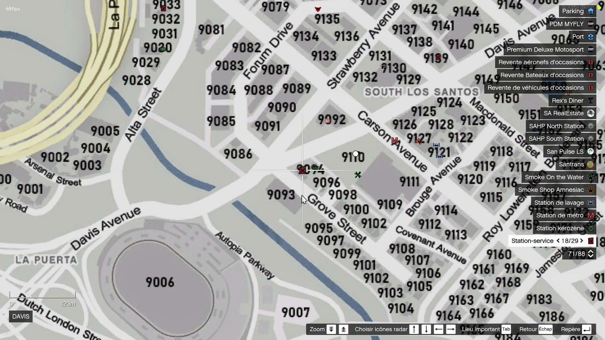
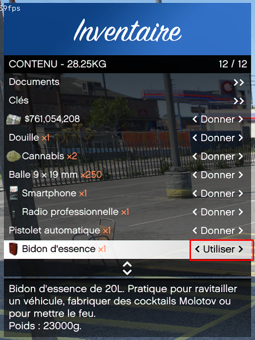

# Carburant

> Auteur de la page: Thomas.

---

## Introduction

Le carburant est une ressource essentielle pour les véhicules. Sans carburant, un véhicule ne peut pas fonctionner. Il est donc important de savoir comment faire le plein de carburant pour ne pas tomber en panne sèche.

## Les types de carburant

Il existe deux types de carburant dans le jeu :
- L'essence (voitures, camions, motos, etc.)
- Le kérosène (hélicoptères et avions)
- Électricité (véhicules électriques)

## Les stations-service / Bornes de recharge

Les stations-service sont les endroits où vous pouvez faire le plein de carburant. Les stations-service sont indiquées sur la carte par une icône de bidon d'essence.

Pour faire le plein de carburant, vous devez utiliser le système de ciblage est visé la pompe à essence. Séléctionnez l'option "Prendre le tuyau" ou "Prendre le câble" pour commencer à faire le plein. Vous pouvez sélectionner un moyen de paiement si nécessaire.

Une fois que vous avez pris le tuyau / câble, vous pouvez vous diriger vers votre véhicule et toujour avec le système de ciblage, viser le vehicule et séléctionner l'option "Brancher le tuyau/câble". Suivez ensuite les indications en haut à gauche de votre écran.

Pour retirer le tuyau / câble, viser la pompe à essence et de séléctionner l'option "Ranger le tuyau" ou "Ranger le câble".

> [!NOTE]
> Il est possible que certaines stations-service n'est plus de carburant. Dans ce cas, vous devrez vous rendre à une autre station.

## Les jerrycans

Les jerrycans sont disponibles à l'achat dans les magasins de bricolage. Ils vous permettent de transporter du carburant pour faire le plein de votre véhicule en cas de panne sèche. Pour remplir un véhicule avec un jerrycan, vous devez utiliser l'item depuis votre inventaire.

Une fois le jerrican en main rapprochez-vous d'un véhicule et utilisez le système de ciblage. Séléctionnez l'option "Remplir le réservoir" pour commencer à faire le plein. Suivez ensuite les indications en haut à gauche de votre écran.

> [!NOTE]
> Il est possible que le jerrican soit vide. Dans ce cas, vous devrez le jeter et en racheter un autre.

## La consommation

La consommation de carburant varie en fonction du type de véhicule, de la vitesse à laquelle vous roulez, etc. Il est donc important de surveiller votre jauge de carburant pour ne pas tomber en panne sèche.

Le niveau de carburant de votre véhicule est indiqué par une jauge en bas à gauche de votre écran.

