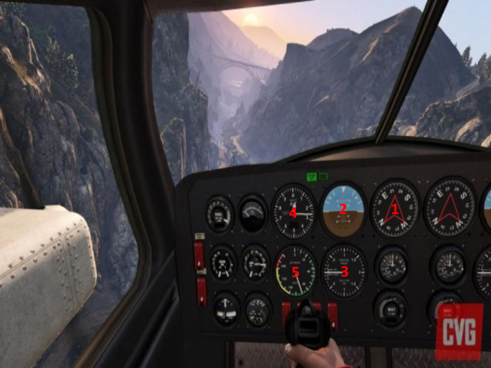
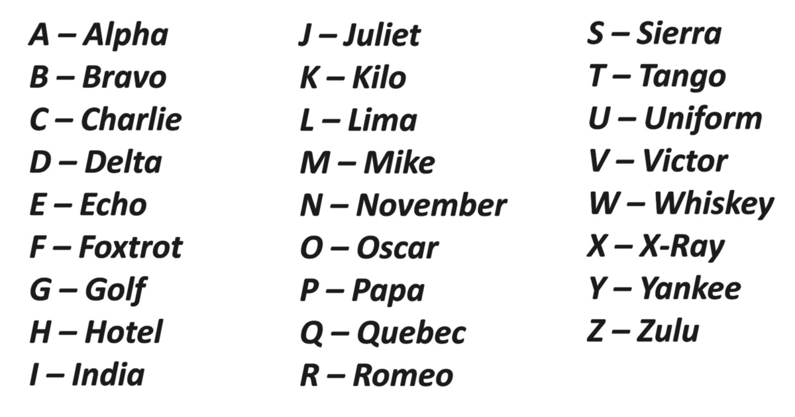
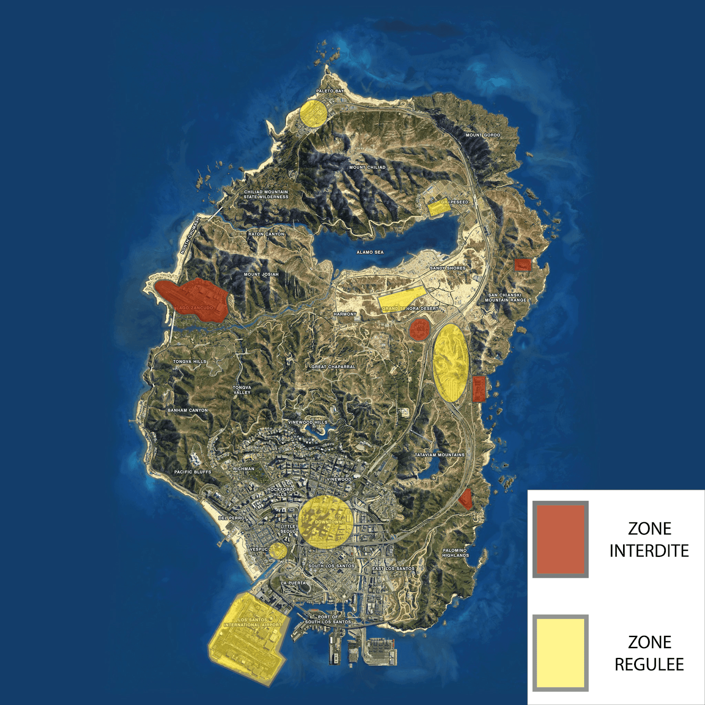

# Formation aviation

---

## Les checklists pré-vol

Déjà une checklist qu’est ce que c’est ? C’est ce que tu dois **impérativement** vérifier avant le départ en vol !

Il existe deux checklists : une checklist extérieure et une intérieure !

> [!NOTE]
> **Une bonne checklist est une checklist qui est audible par l’instructeur, ses passagers, et surtout soi-même !**

### La checklist extérieure

La checklist extérieure **s’effectue dans le sens horaire d’une montre**, peu importe où on commence ! Cela évite les confusions et les doutes.

Voilà ce que tu dois avoir vérifié avant de monter dans l’appareil :

* **L’état général de la totalité du fuselage** (pas de trou, pas de morceau de voilure qui se détache, enfin que l’avion soit clean).
* **L’état des trains d’atterrissage !** On vérifie l’état des pneus et les vérins du train d’atterrissage.
* **La propreté et l’état de la verrière** (s’il y a un trou, on appelle Cargloush ! peu importe la taille !).
* **Les entrées d’air** : il ne faut surtout pas qu’elles soient bouchées. Pareil si c’est un avion à réaction, on vérifie les réacteurs pour déceler de potentiels défauts qui auraient pu apparaître lors du dernier vol.
* **Le niveau d’huile** (A froid).
* **Les éclairages**.
* **Les ailes de l’appareil**
* **La queue de l’appareil (empennage)** : gouvernes de profondeur (horizontal) et gouvernes de direction (verticale)
* **Les antennes de radiocommunication** : qu’elles soient bien fixées...

### La checklist intérieure

Après l’extérieur, on passe à l’intérieur. L’ensemble des instruments s’appelle le tableau de bord.

1. **Conservateur de cap** : Bien vérifier qu’il est en accord avec la boussole, que la direction indiquée soit la même.
2. **Horizon artificiel** : pour l’inclinaison des virages et ta position par rapport au sol.
3. **Le variomètre** : c’est ta vitesse en cabré ou en piqué /min. En gros, ton taux de chute ou de montée. C’est important qu’il soit à 0 au départ.
4. **Altimètre** : ton altitude. Etant donné que **le réglage est effectué en fonction de la pression atmosphérique au niveau de la mer, au démarrage il ne sera jamais à 0**, c’est normal ! Il faut donc que le vario indique une altitude supérieure à 0 pour que ce soit bon.
5. **Badin** : c’est le compteur de vitesse en kmh/mph peu importe.

## Les communications radio

La partie la plus redoutée de tous les élèves pilotes existants, les communications radio.

**Le plus important est de vous faire comprendre.**

### L’alphabet de l’OTAN

Déjà, en aéro, on utilise un seul et unique alphabet : celui de l’OTAN.

### Échanges avec les contrôleurs

Ex après l’allumage de votre radio :

> [Matricule de ton aéronef], tour de … bonjour / bonsoir !
>
> [Matricule de ton aéronef] bonjour / bonsoir !

Imaginons maintenant que t’as décollé et que tu quittes San Andréas pour te rendre à Cayo Perico. Les contrôleurs ne seront pas les mêmes personnes : non seulement **il faut changer sa fréquence radio**, mais aussi redire bonjour à la nouvelle tour avec laquelle tu vas prendre contact ! (même exemple qu’au-dessus)

Après la première prise de contact avec la tour, on répète son matricule.

Ex après la première prise de contact :

> [Matricule de ton aéronef] un Nimbus au parking de L’aéroport de Los Santos pour un vol local sur Los Santos avec 3 personnes à bord.

Enfin la tour va pouvoir te donner, ou non, la clearance pour quitter le parking.

Ex de ce que peut répondre la tour :

> C’est reçu [Matricule de ton aéronef], autorisé décollage piste [n° de piste].

Tu as maintenant terminé ton petit vol local au-dessus de Los Santos, mais maintenant il faut revenir au terrain…

Pour se faire, 3min avant l’arrivée, on appelle la tour pour la prévenir.

Voici l’équation parfaite pour la demande de clearance :

> [Matricule de ton aéronef] + [Ta position actuelle] + [Tes intentions] = Clearance (ou non)

Lorsque la piste est dégagée, tu appelles la tour pour lui dire que la piste est dégagée et que tu retournes au parking. **Surtout, ne prends pas l’initiative de quitter la radio ! C’est la tour qui te dit de quitter ou non !**

### Un peu de vocabulaire spécifique à l’aéro

Voici un petit listing d’expressions et mots qui pourront t’être utile dans certaines situations :

* **MAYDAY MAYDAY MAYDAY** : En cas de détresse: un aéronef peut se poser sur toute zone dégagée ou route sans accord des autorités.
* **PAN PAN PAN** : En cas d’urgence: un aéronef doit revenir sur son terrain initial (s’il le peut uniquement). Il peut atterrir sur une route ou tout autre terrain dégagé avec l’accord des autorités.
* **AFFIRM** : en aéronautique, on ne dit <u>**JAMAIS**</u> “affirmatif”, la  dernière fois que ça a été fait, un avion s’est crashé et des personnes sont mortes. C’est d’ailleurs depuis cet accident que nous disons ça.
* **NÉGATIF**
* **ROGER** : Souvent entendu dans les films aussi, cela signifie que tu as reçu le message, que tu l’as compris et que tu exécutes.

## Zones régulées et zones interdites de survol

Certaines zones sont interdites complètement de survol, pour des raisons de sécurité ou même de confidentialité. C’est le cas de la Base Militaire de Zancudo par exemple.

D’autres zones sont elles régulées, c’est à dire qu’elles sont interdites de survol, sauf dérogation spéciale de la part du gouvernement, c’est le cas par exemple pour le champs d’éoliennes de Sandy Shores, ou du centre ville de Los Santos, plus communément, les aéroports et aérodromes sont des zones régulées, on va éviter de les survoler à basse altitude dans le cas ou un appareil serait en phase d’approche ou en phase de décollage, sauf acceptation de la tour de contrôle.

{docsify-updated}