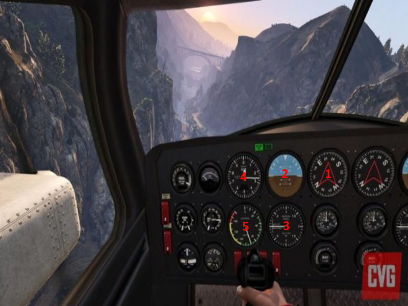
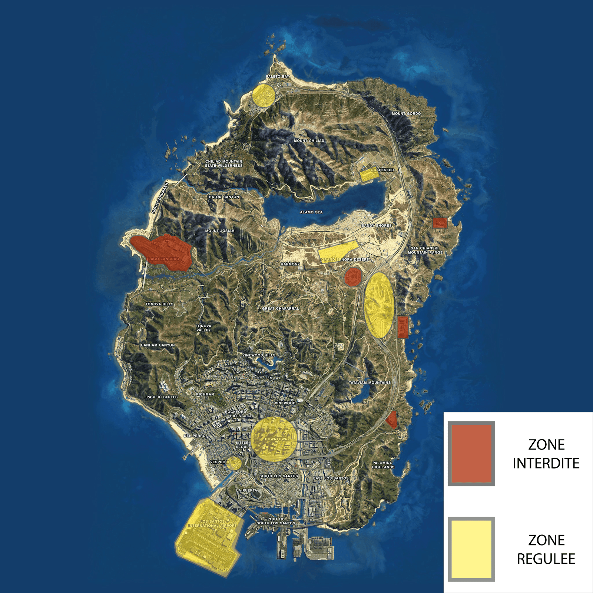

# ✈️ Formation Aviation
---

## La checklist pré-vol

La checklist de Prévol qu’est ce que c’est? C’est ce que tu dois **impérativement** vérifier avant le départ en vol !

> [!NOTE]
> **Une bonne checklist est une checklist qui est audible par l’instructeur, ses passagers, et surtout soi-même !**

### La checklist extérieure

La checklist extérieure **s’effectue dans le sens horaire d’une montre**, peu importe où on commence ! Cela évite les confusions et les doutes.

Voilà ce que tu dois avoir vérifié avant de monter dans l’appareil :

* **L’état général de la totalité du fuselage** (pas de trou, pas de morceau de voilure qui se détache, enfin que l’avion soit clean).
* **L’état des trains d’atterrissage ou patins!** On vérifie l’état des pneus et les vérins du train d’atterrissage ou des patins du un hélicoptère.
* **La propreté et l’état de la verrière** (s’il y a un trou, on appelle Cargloush ! peu importe la taille !).
* **Les entrées d’air** : il ne faut surtout pas qu’elles soient bouchées. Pareil si c’est un avion à réaction, on vérifie les réacteurs pour déceler de potentiels défauts qui auraient pu apparaître lors du dernier vol.
* **Le niveau d’huile** (A froid).
* **Les éclairages**.
* **Les ailes de l’appareil**
* **La queue de l’appareil (empennage)** : gouvernes de profondeur (horizontal) et gouvernes de direction (verticale)
* **Les antennes de radiocommunication** : qu’elles soient bien fixées...

### La checklist intérieure

Après l’extérieur, on passe à l’intérieur. L’ensemble des instruments s’appelle le tableau de bord.

1. **Conservateur de cap** : Bien vérifier qu’il est en accord avec la boussole, que la direction indiquée soit la même.
2. **Horizon artificiel** : pour l’inclinaison des virages et ta position par rapport au sol.
3. **Le variomètre** : c’est ta vitesse en cabré ou en piqué /min. En gros, ton taux de chute ou de montée. C’est important qu’il soit à 0 au départ.
4. **Altimètre** : ton altitude. Etant donné que **le réglage est effectué en fonction de la pression atmosphérique au niveau de la mer, au démarrage il ne sera jamais à 0**, c’est normal ! Il faut donc que le vario indique une altitude supérieure à 0 pour que ce soit bon.
5. **Anémomètre** : c’est le compteur de vitesse en **noeuds**.

## Les communications radio

La partie la plus redoutée de tous les élèves pilotes existants, les communications radio.
Tout d'abord une connexion oblogatoire sur la fréquence de votre secteur de vol. 

  <table style="
    display: inline-table;
    width: auto;
    border-collapse: collapse;
    font-family: Consolas, 'Courier New', monospace;
    font-size: 18px;
    color: #9ef2c9;
    background: transparent;
    border: 2px solid #1f3d2b;
    text-align: center;
  ">
    <thead>
      <tr>
        <th colspan="2" style="
          padding: 16px 22px;
          border-bottom: 2px solid #1f3d2b;
          letter-spacing: 2px;
          font-weight: 700;
        ">
          CONTROLE AERIEN - FREQUENCES
        </th>
      </tr>
      <tr>
        <th style="padding: 12px 22px; border-bottom: 2px solid #1f3d2b;">
          ESPACE AERIEN
        </th>
        <th style="padding: 12px 22px; border-bottom: 2px solid #1f3d2b;">
          FREQUENCE
        </th>
      </tr>
    </thead>
    <tbody>
      <tr>
        <td style="
          padding: 14px 22px;
          border-top: 1px solid #13271c;
          border-right: 2px solid #1f3d2b;
        ">
          SAN ANDREAS
        </td>
        <td style="
          padding: 14px 22px;
          border-top: 1px solid #13271c;
        ">
          1
        </td>
      </tr>
      <tr>
        <td style="
          padding: 14px 22px;
          border-top: 1px solid #13271c;
          border-right: 2px solid #1f3d2b;
        ">
          INTERNATIONAL
        </td>
        <td style="
          padding: 14px 22px;
          border-top: 1px solid #13271c;
        ">
          2
        </td>
      </tr>
    </tbody>
  </table>

**Le plus important est de vous faire comprendre.**

### L’alphabet de l’OTAN

Déjà, en aéro, on utilise un seul et unique alphabet : celui de l’OTAN.

  <table style="
    display: inline-table;
    width: auto;
    border-collapse: collapse;
    font-family: Consolas, 'Courier New', monospace;
    font-size: 18px;
    color: #9ef2c9;
    background: transparent;
    border: 2px solid #1f3d2b;
    text-align: center;
  ">
    <thead>
      <tr>
        <th colspan="8" style="
          padding: 14px 20px;
          border-bottom: 2px solid #1f3d2b;
          letter-spacing: 2px;
          font-weight: 700;
        ">
          ALPHABET PHONÉTIQUE OTAN
        </th>
      </tr>
      <tr>
        <th style="padding:10px; border-bottom:2px solid #1f3d2b;">LETTRE</th>
        <th style="padding:10px; border-bottom:2px solid #1f3d2b;">CODE</th>
        <th style="padding:10px; border-bottom:2px solid #1f3d2b;">LETTRE</th>
        <th style="padding:10px; border-bottom:2px solid #1f3d2b;">CODE</th>
        <th style="padding:10px; border-bottom:2px solid #1f3d2b;">LETTRE</th>
        <th style="padding:10px; border-bottom:2px solid #1f3d2b;">CODE</th>
        <th style="padding:10px; border-bottom:2px solid #1f3d2b;">LETTRE</th>
        <th style="padding:10px; border-bottom:2px solid #1f3d2b;">CODE</th>
      </tr>
    </thead>
    <tbody>
      <tr>
        <td style="padding:12px; border-right:2px solid #1f3d2b;">A</td><td style="padding:12px;">ALFA</td>
        <td style="padding:12px; border-left:2px solid #1f3d2b;">B</td><td style="padding:12px;">BRAVO</td>
        <td style="padding:12px; border-left:2px solid #1f3d2b;">C</td><td style="padding:12px;">CHARLIE</td>
        <td style="padding:12px; border-left:2px solid #1f3d2b;">D</td><td style="padding:12px;">DELTA</td>
      </tr>
      <tr>
        <td style="padding:12px; border-right:2px solid #1f3d2b;">E</td><td style="padding:12px;">ECHO</td>
        <td style="padding:12px; border-left:2px solid #1f3d2b;">F</td><td style="padding:12px;">FOXTROT</td>
        <td style="padding:12px; border-left:2px solid #1f3d2b;">G</td><td style="padding:12px;">GOLF</td>
        <td style="padding:12px; border-left:2px solid #1f3d2b;">H</td><td style="padding:12px;">HOTEL</td>
      </tr>
      <tr>
        <td style="padding:12px; border-right:2px solid #1f3d2b;">I</td><td style="padding:12px;">INDIA</td>
        <td style="padding:12px; border-left:2px solid #1f3d2b;">J</td><td style="padding:12px;">JULIETT</td>
        <td style="padding:12px; border-left:2px solid #1f3d2b;">K</td><td style="padding:12px;">KILO</td>
        <td style="padding:12px; border-left:2px solid #1f3d2b;">L</td><td style="padding:12px;">LIMA</td>
      </tr>
      <tr>
        <td style="padding:12px; border-right:2px solid #1f3d2b;">M</td><td style="padding:12px;">MIKE</td>
        <td style="padding:12px; border-left:2px solid #1f3d2b;">N</td><td style="padding:12px;">NOVEMBER</td>
        <td style="padding:12px; border-left:2px solid #1f3d2b;">O</td><td style="padding:12px;">OSCAR</td>
        <td style="padding:12px; border-left:2px solid #1f3d2b;">P</td><td style="padding:12px;">PAPA</td>
      </tr>
      <tr>
        <td style="padding:12px; border-right:2px solid #1f3d2b;">Q</td><td style="padding:12px;">QUEBEC</td>
        <td style="padding:12px; border-left:2px solid #1f3d2b;">R</td><td style="padding:12px;">ROMEO</td>
        <td style="padding:12px; border-left:2px solid #1f3d2b;">S</td><td style="padding:12px;">SIERRA</td>
        <td style="padding:12px; border-left:2px solid #1f3d2b;">T</td><td style="padding:12px;">TANGO</td>
      </tr>
      <tr>
        <td style="padding:12px; border-right:2px solid #1f3d2b;">U</td><td style="padding:12px;">UNIFORM</td>
        <td style="padding:12px; border-left:2px solid #1f3d2b;">V</td><td style="padding:12px;">VICTOR</td>
        <td style="padding:12px; border-left:2px solid #1f3d2b;">W</td><td style="padding:12px;">WHISKEY</td>
        <td style="padding:12px; border-left:2px solid #1f3d2b;">X</td><td style="padding:12px;">XRAY</td>
      </tr>
      <tr>
        <td style="padding:12px; border-right:2px solid #1f3d2b;">Y</td><td style="padding:12px;">YANKEE</td>
        <td style="padding:12px; border-left:2px solid #1f3d2b;">Z</td><td style="padding:12px;">ZULU</td>
        <td style="padding:12px;"></td><td style="padding:12px;"></td>
        <td style="padding:12px;"></td><td style="padding:12px;"></td>
      </tr>
    </tbody>
  </table>

### Matricule de mon aéronef

>November 000 LETTRES/Catégorie

*000* correspond au 3 derniers chiffre de l'immatriculation de l'aéronef (immatriculation donné par le jeu)
LETTRES/Catégorie correspond à la liste suivante. 2 lettres (prononcé avec l'alphabet de l'Otan) correspondant à un service lié.
L'objectif est d'identifier l'appartenance plus rapidement des engins liés aux services et à l'immatriculation d'origine, lors des communications radio.

**Lettre/Catégorie**

<table
  cellpadding="6"
  cellspacing="0"
  style="
    border-collapse: collapse;
    font-family: Arial, sans-serif;
    font-size: 14px;
    text-align: center;
    width: 100%;
  "
>
  <tr>
    <th>Code</th>
    <th>Organisation</th>
  </tr>
  <tr>
    <td>HP</td>
    <td>SAHP</td>
  </tr>
  <tr>
    <td>PD</td>
    <td>LSPD</td>
  </tr>
  <tr>
    <td>LS</td>
    <td>LSSD</td>
  </tr>
  <tr>
    <td>SO</td>
    <td>BCSO</td>
  </tr>
  <tr>
    <td>MS</td>
    <td>Medical Service</td>
  </tr>
  <tr>
    <td>LF</td>
    <td>LSFD</td>
  </tr>
  <tr>
    <td>BC</td>
    <td>BCFD</td>
  </tr>
  <tr>
    <td>GV</td>
    <td>Gouvernement</td>
  </tr>
  <tr>
    <td>AA</td>
    <td>San Andreas State Aviation Administration</td>
  </tr>
  <tr>
    <td>MR</td>
    <td>Militaire</td>
  </tr>
  <tr>
    <td>PX</td>
    <td>Privé / autre</td>
  </tr>
</table>

Exemple pour un aéronef du BCFD immatriculé **98FYI702**
Le matricule de l’aéronef radio est donc *November 702 Bravo Charlie*

### La prise de contact

La communication radio est dans un sens déclaratif. Aucune réponse ou autorisation de la part d’une tour de contrôle n’est attendue.
Il est toutefois possible qu’un autre pilote vous réponde pour vous indiquer qu’il est déjà présent sur la piste ou autre.

Vous voici à votre première communication radio! N’oubliez jamais une chose, le plus important est de se faire comprendre de tous!
Pour vous annoncer sur les ondes il y a trois zones, la zone de Los Santos, celle de Blaine et vous avez Cayo Perico en dehors de notre état. Puis à la fin vous ajouterez un trafic pour informer les autres pilotes que vous parlez bien à eux.

>* Blaine County Traffic Bonjour
>* Los Santos Traffic Bonjour
>* Cayo Périco Traffic Bonjour

Suite à cela vous ajoutez votre callsign comme vu en partie B de ce chapitre, vous indiquez le modèle de votre aéronef, vous indiquez votre position et puis en dernier vos intentions pour le vol.

>*Exemple: Blaine County Traffic Bonjour, N752PX, un Buckhingam Vestra au départ de Sandy Shores pour un tour de piste.*

Le changement entre Blaine County Traffic et Los Santos Traffic s'effectue au franchissement de la route 68.

Le changement entre Los Santos Traffic / Blaine County Traffic et Cayo Perico est quand l'île deviens en vue et quand elle disparait de votre vue

### Le roulage/ La Translation

Le roulage/translation est la phase ou l’aéronef roule au sol pour rejoindre soit la piste de décollage ou le hangar. Dans le cas d’un hélicoptère on parle d’une **translation**. C’est le fait de voler à quelques mètres du sol pour faire la même chose qu’un avion que ce soit rejoindre la piste de décollage, l'héli pad ou le hangar. Le principe de la communication reste le même sur l’unicom, vous annoncez vos intentions et ne demandez pas d’autorisations. La seule raison pour laquelle vous ne pourriez pas faire ce que vous aviez l’intention de faire c’est si un autre pilote vous informe qu’il est déjà en train de faire ce que vous souhaitez faire ou est déjà entrepris dans une manœuvre sur le même axe que vous. Par courtoisie et par sécurité, vous attendez donc qu’il ait fini son mouvement avant de faire le vôtre. <ins>**Cela s’applique à n’importe quelle phase de vol**</ins>.

>Exemple:
>* Avion: Blaine County Traffic, N752PX roule pour la piste 13.
>* Hélicoptère: Blaine County Traffic, N752PX translate pour la piste 13.

### Le décollage / L'atterrissage

Dans ce cas, les informations dites dans la partie précédente s'appliquent tout autant. Ici nous informons nôtre intention de décoller ou d’atterrir. A informer en général 30 secondes avant d’accomplir l’acte.

>Exemple:
>* Blaine County Traffic, N752PX décolle de la piste 13.
>* Blaine County Traffic, N752PX atterri sur la piste 13.

Une fois décollé ou atterri il ne faut pas oublier de signaler aux autres pilotes que vous avez dégagé la piste.

>Exemple: Blaine County traffic, N752PX a libéré la piste 13

### Un peu de vocabulaire spécifique à l’aéro

Voici un petit listing d’expressions et mots qui pourront t’être utile dans certaines situations :

* MAYDAY MAYDAY MAYDAY : En cas d’urgence immédiate. Cela permet de déroger à certaines régulations telles que le fait de pouvoir atterrir sur n’importe quel terrain libre et vous donne priorité sur tout autre appareil.
* PAN-PAN PAN-PAN PAN-PAN: En cas de panne qui ne nécessite pas un atterrissage immédiat. Informez les autres pilotes que vous rencontrez des difficultés et que vous allez essayer de diagnostiquer le problème.

>Exemples:
>* MAYDAY MAYDAY MAYDAY, N752PX nous avons perdu un de nos moteurs, nous retournons sur Sandy Shores Immédiatement.
>Si d’autres aéronefs sont dans la zone, ils devront faire attention à laisser l’espace libre a N752PX qu’il puisse ce poser immédiatement à Sandy Shores.
>* PAN-PAN PAN-PAN PAN-PAN, N752PX, notre train d’atterrissage ne sort pas, nous allons faire des tours afin de diagnostiquer la panne.
>Si d’autres aéronefs sont dans la zone, ils feront attention à ne pas gêner N752PX dans ses manœuvres.

## Les altitudes de survol des différents territoires

  <table style="
    display:inline-table;
    border-collapse:collapse;
    font-family:Consolas, 'Courier New', monospace;
    font-size:18px;
    color:#9ef2c9;
    background:transparent;
    border:2px solid #1f3d2b;
    text-align:center;
  ">
    <thead>
      <tr>
        <th colspan="4" style="
          padding:14px 20px;
          border-bottom:2px solid #1f3d2b;
          letter-spacing:2px;
          font-weight:700;
        ">
          NOTAM — RÈGLES D’ALTITUDES DE SURVOL
        </th>
      </tr>
      <tr>
        <th style="padding:10px 18px; border-bottom:2px solid #1f3d2b;">
          ZONE / CATÉGORIE
        </th>
        <th style="padding:10px 18px; border-bottom:2px solid #1f3d2b;">
          ALTITUDE
        </th>
        <th style="padding:10px 18px; border-bottom:2px solid #1f3d2b;">
          OBSTACLES
        </th>
        <th style="padding:10px 18px; border-bottom:2px solid #1f3d2b;">
          REMARQUES
        </th>
      </tr>
    </thead>
    <tbody>
      <!-- RÈGLES GÉNÉRALES -->
      <tr>
        <td style="padding:12px 18px; border-top:1px solid #13271c; border-right:2px solid #1f3d2b;">
          AGGLOMÉRATION
        </td>
        <td style="padding:12px 18px; border-top:1px solid #13271c; border-right:2px solid #1f3d2b;">
          ≥ 1500 FT
        </td>
        <td style="padding:12px 18px; border-top:1px solid #13271c; border-right:2px solid #1f3d2b;">
          +500 FT
        </td>
        <td style="padding:12px 18px; border-top:1px solid #13271c;">
          RÈGLE GÉNÉRALE
        </td>
      </tr>
      <tr>
        <td style="padding:12px 18px; border-top:1px solid #13271c; border-right:2px solid #1f3d2b;">
          HORS AGGLOMÉRATION
        </td>
        <td style="padding:12px 18px; border-top:1px solid #13271c; border-right:2px solid #1f3d2b;">
          ≥ 800 FT
        </td>
        <td style="padding:12px 18px; border-top:1px solid #13271c; border-right:2px solid #1f3d2b;">
          +200 FT
        </td>
        <td style="padding:12px 18px; border-top:1px solid #13271c;">
          RÈGLE GÉNÉRALE
        </td>
      </tr>
      <tr>
        <td style="padding:12px 18px; border-top:1px solid #13271c; border-right:2px solid #1f3d2b;">
          MER
        </td>
        <td style="padding:12px 18px; border-top:1px solid #13271c; border-right:2px solid #1f3d2b;">
          ≤ 800 FT
        </td>
        <td style="padding:12px 18px; border-top:1px solid #13271c; border-right:2px solid #1f3d2b;">
          —
        </td>
        <td style="padding:12px 18px; border-top:1px solid #13271c;">
          ALTITUDE MAXIMALE
        </td>
      </tr>
      <!-- EXCEPTIONS -->
      <tr>
        <td style="padding:12px 18px; border-top:2px solid #1f3d2b; border-right:2px solid #1f3d2b;">
          JOURNALISTES
        </td>
        <td style="padding:12px 18px; border-top:2px solid #1f3d2b; border-right:2px solid #1f3d2b;">
          ≥ 800 FT
        </td>
        <td style="padding:12px 18px; border-top:2px solid #1f3d2b; border-right:2px solid #1f3d2b;">
          +500 FT
        </td>
        <td style="padding:12px 18px; border-top:2px solid #1f3d2b;">
          DÉROGATION MÉDIA
        </td>
      </tr>
      <tr>
        <td style="padding:12px 18px; border-top:1px solid #13271c; border-right:2px solid #1f3d2b;">
          POLICE (PATROUILLE)
        </td>
        <td style="padding:12px 18px; border-top:1px solid #13271c; border-right:2px solid #1f3d2b;">
          ≥ 500 FT
        </td>
        <td style="padding:12px 18px; border-top:1px solid #13271c; border-right:2px solid #1f3d2b;">
          +300 FT
        </td>
        <td style="padding:12px 18px; border-top:1px solid #13271c;">
          DÉROGATION OPÉRATIONNELLE
        </td>
      </tr>
      <tr>
        <td style="padding:12px 18px; border-top:1px solid #13271c; border-right:2px solid #1f3d2b;">
          SERVICES PUBLICS (INTERVENTION)
        </td>
        <td style="padding:12px 18px; border-top:1px solid #13271c; border-right:2px solid #1f3d2b;">
          ≥ 500 FT
        </td>
        <td style="padding:12px 18px; border-top:1px solid #13271c; border-right:2px solid #1f3d2b;">
          +300 FT
        </td>
        <td style="padding:12px 18px; border-top:1px solid #13271c;">
          PRIORITÉ INTERVENTION
        </td>
      </tr>
      <!-- INTERDICTIONS -->
      <tr>
        <td style="padding:12px 18px; border-top:2px solid #1f3d2b; border-right:2px solid #1f3d2b;">
          ORAGES / INTEMPÉRIES
        </td>
        <td style="padding:12px 18px; border-top:2px solid #1f3d2b; border-right:2px solid #1f3d2b;">
          INTERDIT
        </td>
        <td style="padding:12px 18px; border-top:2px solid #1f3d2b; border-right:2px solid #1f3d2b;">
          —
        </td>
        <td style="padding:12px 18px; border-top:2px solid #1f3d2b;">
          VOL PROHIBÉ
        </td>
      </tr>
      <tr>
        <td style="padding:12px 18px; border-top:1px solid #13271c; border-right:2px solid #1f3d2b;">
          FLY-BY / LOW PASS
        </td>
        <td style="padding:12px 18px; border-top:1px solid #13271c; border-right:2px solid #1f3d2b;">
          INTERDIT
        </td>
        <td style="padding:12px 18px; border-top:1px solid #13271c; border-right:2px solid #1f3d2b;">
          —
        </td>
        <td style="padding:12px 18px; border-top:1px solid #13271c;">
          SAUF DÉROGATION GOV + SASAA
        </td>
      </tr>
    </tbody>
  </table>

## Zones régulées et zones interdites de survol

Certaines zones sont interdites complètement de survol comme précisé dans l’article 8.1 du code pénal, pour des raisons de sécurité ou même de confidentialité. C’est le cas de la Base Militaire de Zancudo par exemple.

D’autres zones sont elles régulées, c’est à dire qu’elles sont interdites de survol, sauf dérogation spéciale de la part du gouvernement, c’est le cas par exemple pour le champs d’éoliennes de Sandy Shores, ou du centre ville de Los Santos, plus communément, les aéroports et aérodromes sont des zones régulées, on va éviter de les survoler à basse altitude dans le cas ou un appareil serait en phase d’approche ou en phase de décollage, sauf acceptation de la tour de contrôle.

