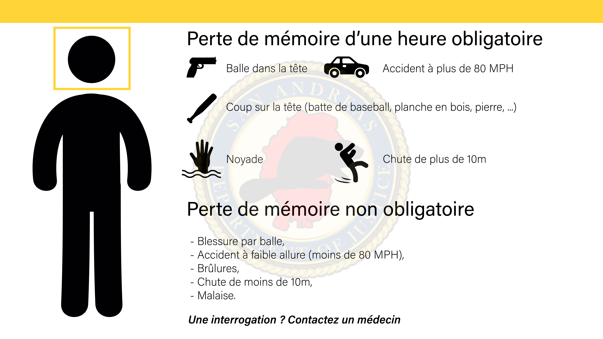

# Règlement serveur Life US

---

> [!NOTE]
> Les règles suivantes ont pour but d’éviter bon nombre de conflits et de comportements qui ne correspondent pas à l’esprit SADoJ.
>
> On peut tous faire des erreurs, nous sommes humains, mais ce qui est réellement important, c’est apprendre de ses erreurs et être capable de ne pas les reproduire à l’avenir.
>
> Le vote sanction doit rester une procédure exceptionnelle non banalisée.

## Généralités

* Toute triche, utilisation, exploitation de bug est interdite.
* Il est obligatoire d’être connecté sur le TeamSpeak dans un des canaux “**Serveur Life**” lorsque vous êtes sur le serveur **Life**. *Il est conseillé d’être connecté sur le TeamSpeak lorsque vous êtes connecté sur un des serveurs.*
* Il est interdit d'être en communication vocale hors de TeamSpeak lorsque vous êtes en jeu.
* Il est interdit de partager son écran lorsque vous êtes en jeu.
* Il est interdit de parler **H**ors-**R**ôle-**P**lay lorsque vous êtes en jeu.
* L’usage d’informations vues sur un stream/hors de l’immersion roleplay est interdit, même en utilisant le terme “J’ai regardé ta GoPro”. De même qu’il est formellement interdit de regarder un live étant en jeu (streamstalk).
* Il est interdit d’écouter une conversation si vous n’en avez pas la capacité (à distance, pas dans la même pièce/même étage (sauf à travers une porte)).
* Il est interdit d’écouter et d’utiliser l’audio entendu via les caméras de surveillance.
* Il est strictement interdit de se déconnecter ou quitter le jeu afin d’éviter une interaction.
* L’utilisation d’un nom appartenant à une personne connue (Pablo Escobar, Tony Montana, Bonnie Tyler, etc….), ainsi que l’utilisation de jeux de mots (Alain Terrieur, Jean Bonneau, etc….) est interdite.
* Il est interdit de spammer les centrales d’appels. Il faut attendre quelques minutes avant de rappeler.
* Il arrive que certains masques ou des casques s’enlèvent sans que les porteurs le veuillent, il est donc demandé aux joueurs d’oublier le visage qu’ils auraient pu voir/ découvrir le temps que la personne remettre son casque/ masque. L’utilisation de ce bug est interdite, car considéré comme **H**ors-**R**ôle-**P**lay.
* Il est obligatoire d’avoir l’item *Radio* dans l’inventaire quand communique à la radio (whisper TS) (dans le coffre du véhicule si c’est une radio de véhicule)
* Un personnage ne peut pas être reconnu par sa voix ou son accent ou si son visage est dissimulé : Exemples : foulard, cagoule, casque, barbe épaisse et la combinaison lunettes et chapeau, casquette, bonnet, casque. Une casquette seule et une paire de lunettes seule ne suffisent pas. De même, la féminité et la masculinité du corps ou de la voix peuvent être supposées (à tort ou à raison, et toujours sans permettre d’identifier UNE personne en particulier).
* Un membre qui souhaite faire revenir son personnage commencera de zéro (argent, biens, etc…) (dont les membres ayant quitté la communauté).
* Toute suppression non souhaité de documents RP, sites RP, réseaux sociaux RP, Discord RP, etc… est interdite.
* Seul les PNJ physiquement présents sont à prendre en compte en RP (on n’imagine pas ni invente des PNJ). Si ils vous voient faire un acte illégal, ils est conseillé de prévenir les services de secours (à vous de faire un appel anonyme).
* Obligation de porter une Bodycam lors d’une action pour qu’elle soit considérée comme présente (et être utilisée) Exception technique : Non obligatoire pour les tenues SWAT qui nécessite une cagoule.
* Une limite d’item vêtement sur soi a été fixée à **60**. Au-delà une suppression des tenues etc… pourra être faite **(le joueur devra être averti avant)**.
* [Termes RolePlay](life/rules/terms.md)
* Il est interdit d’effectuer tout type de scènes sexuelles “Hard” (Pratique Sado, scato, …) même consenti.
* Le sexe classique est autorisé si les personnes sont consentantes.
* Il est obligatoire de faire valider son background à chaque changement de personnage, second personnage et pour les nouveaux arrivants via le formulaire.
* Seules les informations des comptes X (Twitter) suivis par le compte de la communauté peuvent être prises en compte en RP.

## La vie / la mort

* La valeur de la vie : préserver la vie de votre personnage doit être plus important que tout le reste. Ne pas se rendre/fuir/obtempérer, en situation désespérée, sera considéré comme du No-Fear-Rôle-Play (grosse infériorité numérique et de moyen avec la police, hélico etc.., encerclé par l’ennemi, etc…).
* Pour la perte de mémoire suite à un état inconscient, se référer à l’image:

* Pour être valide, un testament doit être déposé avant la mort d’un personnage auprès d’un procureur (si procureur pnj souhaité, voir le groupe justice)
* Le RP médical est régi par le [ce document](life/rules/medical.md).
* Il faut faire attention de ne pas annoncer une mort de manière prématurée (en attente du résultat du vote par exemple). Les termes d’état très inquiétant, mort cérébrale sont possibles afin de faire comprendre les différents acteurs.

## La mort Rôle-Play / départ du personnage

* **Situation 1:** Chaque joueur peut demander le départ ou la mort de son personnage si son personnage possède une ancienneté (création) **d’au moins 3 mois**. Ceci est validé ou non par un vote de la communauté (en réunion le dimanche).
* **Situation 2:** Les situations accidentelles (indépendantes de la volonté du joueur) pouvant entraîner la mort d’un personnage.
  * Le joueur a deux choix:
    * soit son accident conduit à des blessures et il va à l’hôpital.
    * soit il demande sa mort **R**ôle-**P**lay à la communauté.
  * Un vote (le jour même ou lendemain afin de ne pas pénaliser le membre) sera effectué par la communauté pour décider de la mort **R**ôle-**P**lay du personnage.
    * En cas de vote négatif, le joueur sort de l’hôpital et continue sa vie.
    * En cas de vote positif, le joueur refait un personnage.
* **Situation 3:** [La mort RP Dark](life/rules/dark.md?id=mort-rp-dark).
* **Situation 4:** [La mort RP Justice](life/rules/perpetuity.md).
* Cas des joueurs en stream : pour suivre une “logique” dans leur perso et respecter le vote de la communauté, ces personnes devront figer l’action et ne pas déclarer eux-mêmes une mort **R**ôle-**P**lay.
* Autre situation : Si quelqu’un veut se suicider, sa mort **R**ôle-**P**lay devra être votée par la communauté. **(Situation 1)**
* Imposer sa mort **R**ôle-**P**lay au ne pas respecter les nouvelles règles aboutira à un vote sanction pour respecter le vote de la communauté et le **R**ôle-**P**lay des autres joueurs.
* Il faut faire attention de ne pas annoncer une mort de manière prématurée (en attente du résultat du vote par exemple). Les termes d’état très inquiétant, mort cérébrale sont possibles afin de faire comprendre les différents acteurs.

## Multi personnage

* L’autorisation de pouvoir crée un autre personnage passera par un vote de la communauté.
* Il faut être dans la communauté depuis 3 mois minimum pour faire la demande.
* Le départ ou la mort d’un personnage se doit de respecter le règlement en vigueur. *(voir La mort Rôle Play- départ du personnage).*
* Le changement de personnage est autorisé en cours d’une session de jeu.
* Toute interaction entre vos personnages est interdite (physique, matériel, correspondance, pécuniaire) si elle vise à avantager un des deux personnages (partage d’une information, don d’argent etc.)
* Le second personnage a le droit de louer, acheter et vendre un bien immobilier sur le plan professionnel ou personnel.
* L’avatar à le droit de prétendre à tous les emplois présent sur le serveur.
  * Exceptions :
    * Il est interdit d’avoir un personnage dans le domaine du dark et un autre dans le domaine de la justice (juge, avocat, procureur, etc …).
    * Il est interdit d’avoir un personnage dans une organisation et un autre dans la police (tous services confondus).
    * Note: Il est autorisé d’avoir un personnage dans le domaine du dark (sans être dans une organisation) et un autre dans la police cependant le second ne peut faire des investigations & enquêtes.

## Déplacements / Véhicules

* Il est Interdit de “custom” un véhicule sans garagiste présent (sauf custom illégal).
* Par temps de pluie/neige/brouillard, il convient de faire attention à sa manière de conduire, surtout avec des engins type motos ou des voitures sportives.
* Il est interdit de se déplacer constamment en sprintant, pareil en vélo.
* Le carkill, qui consiste à écraser volontairement quelqu’un sans raison valable, est strictement interdit.
* Le Numéro VIN du véhicule ce trouve en haut du tableau de bord coté conducteur (facilement visible par le pare-brise).
* La conduite en off-road sur un terrain difficile et La conduite sur piste de montagne, avec d’important trous ou passage difficile nécessite un véhicule adapté (moto cross, quad, VTT, véhicule avec une garde au sol haute).
* La conduite sur piste en sable ou terre sans passage difficile, trous, et relativement plat ne nécessite pas de véhicule adapté.
* Si le véhicule ne possède pas physiquement d’arceaux ou des équipements supplémentaires de sécurité, ils ne pourront pas êtres inventés.

## Immobilier

* Un personnage ou une entreprise ne peut pas vivre dans plus de deux logements avec intérieur, les autres biens possédés devront être mis en location ou mis à disposition.
* Il est obligatoire de pouvoir retrouver les biens en location ou en vente avec intérieur dans le canal Discord “immo-dispo-rp”. Les propriétés sans intérieur sont exclu de ce système sauf si inclus dans un document externe au canal.
* L'accord d'un économiste suffit pour approuver l'achat d'un bien PNJ.
* L’usage d’un bien immobilier avec intérieur non duplicable se doit d’être justifié à la demande des économistes afin d’éviter tout blocage d’un bien dans lequel du rôle play pourrait se developper. Dans le cas ou l’usage n’est pas justifié (*vote interne des économistes après réception des éléments*), le bien doit être remis sur le marché de la vente ou de la location. Le joueur locataire ou propriétaire (*celui qui l’utilise*) ou gérant de l’entreprise (*dans le cas d’un bien occupé par une entreprise*) possède un droit de recours avec un vote communautaire.

## Entreprises

* Chaque personnage peut posséder deux entreprises au maximum (plus de 50% des parts).

## Hospitalisation

* Voici les temps d’hospitalisation sur le Life. (hôpitaux & hôpitaux dark)
  * Valable uniquement si il y a du personnel soignant à l’hôpital.
  * Les soins et temps d’hospitalisations ne sont pas cummulable sauf demande du joueur.
  * Le temps d’hospitalisation est facultatif.

| Raison de la consultation                 | Temps des soins | Temps d’hospitalisation |
|-------------------------------------------|-----------------|-------------------------|
| Balles dans zone vitale                   | 15 minutes      | 15 minutes              |
| Balles dans zone non vitale               | 10 minutes      | 5 minutes               |
| Accident inter véhicule à forte cinétique | 10 minutes      | 15 minutes              |
| Accident inter vehicule à basse cinétique | 10 minutes      | 0 minute                |
| Accident exter véhicule à forte cinétique | 15 minutes      | 15 minutes              |
| Accident exter vehicule à basse cinétique | 5 minutes       | 0 minute                |
| Chute de moins de 2 mètres                | 10 minutes      | 0 minute                |
| Chute de plus de 2 mètres                 | 10 minutes      | 15 minutes              |
| Laision interne                           | 10 minutes      | 10 minutes              |
| Fracture                                  | 10 minutes      | 10 minutes              |
| Brulure légère                            | 5 minutes       | 0 minute                |
| Brulure grave                             | 10 minutes      | 10 minutes              |
| Plaie légère                              | 5 minutes       | 0 minute                |
| Plaie grave                               | 10 minutes      | 10 minutes              |

## Cayo Perico

* L’île possède un lore bien défini. Vous pouvez le consulter [ici](life/guides/cayoperico.md).
* Il est interdit d’acheter une propriété sur l’île.
* La location immobilière pour une durée de + de 24H est interdite.
* Aucun véhicules personnels ne sont admis.

## Autre

* Pour toute modification sur le serveur Life qui a des conséquences sur tous les joueurs, il est obligatoire de faire voter cette modification par la communauté sauf exception propre à un groupe, et d’inscrire le changement dans le canal #change_log.
* Interdit de modifier des questions une fois la réponse donnée (sinon vice procédure) dans le Labo Police et interdit de mentir dans les réponses L’usage de toutes vidéos, stream peu importe son origine et qui permettrait de répondre de manière précise, véritable est autorisée.
* Les services de secours ont l’obligation de transmettre également sur les scanner presse sur TeamSpeak. Exception pour les canaux sécurisés.
* L’utilisation des notifications en jeux est interdit dans les conditions suivantes:
  * Message publicitaire ou propagande sauf presse.
  * Message de disponibilité d’une entreprise, d’un service, sauf presse (privilégier l’utilisation du marketplace).
* L’utilisation des notifications en jeux est autorisé dans les conditions suivantes:
  * Message de prévention (alerte trafic, sensibilisation, …).
  * Annonce d’évènement (audience, course, soirée publique, …).
* Il est interdit d’acheter un véhicule destiné à une société si vous ne faites pas partie de la société et/ou si le patron n’a pas donné son accord. De même, il est interdit d’acheter un véhicule destiné au service public (police, médecins, pompiers, etc.) si vous ne faites pas partie du service et/ou si le chef n’a pas donné son accord.
* La communauté n'a pas le pouvoir de modifier le code pénal (document RP). Seul le groupe justice peut y apporter des modifications. Le groupe justice conserve le droit de solliciter l'avis de la communauté pour une modification importante.

> Le règlement de la communauté pour et par la communauté.

{docsify-updated}
